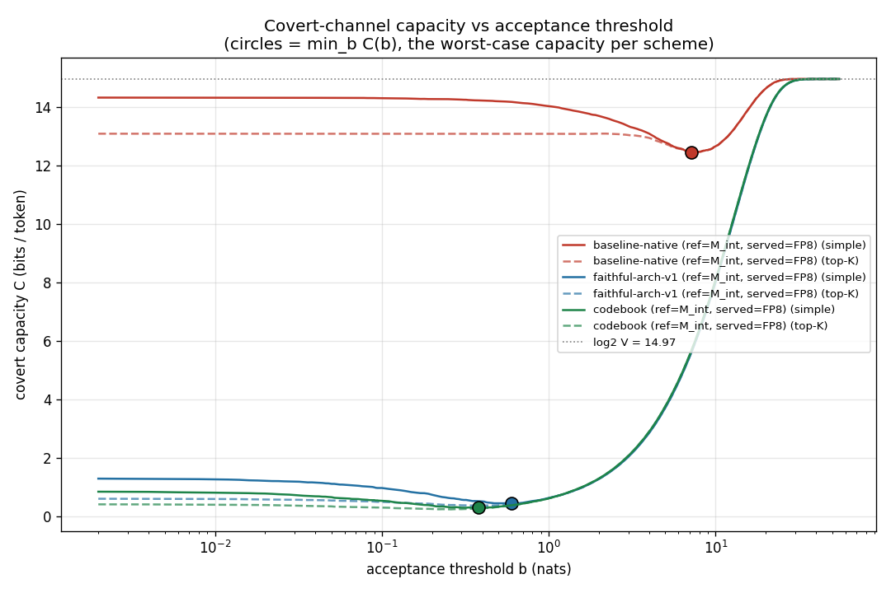
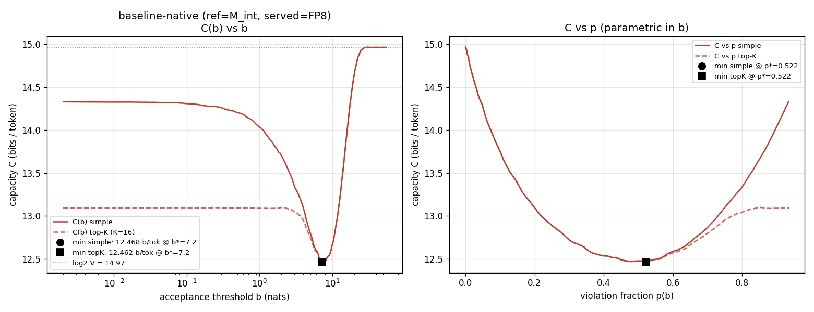
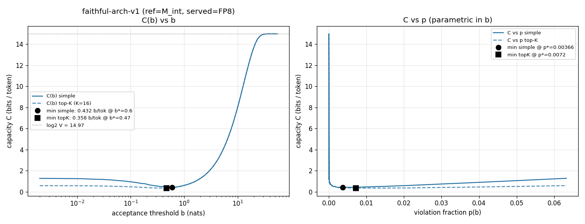
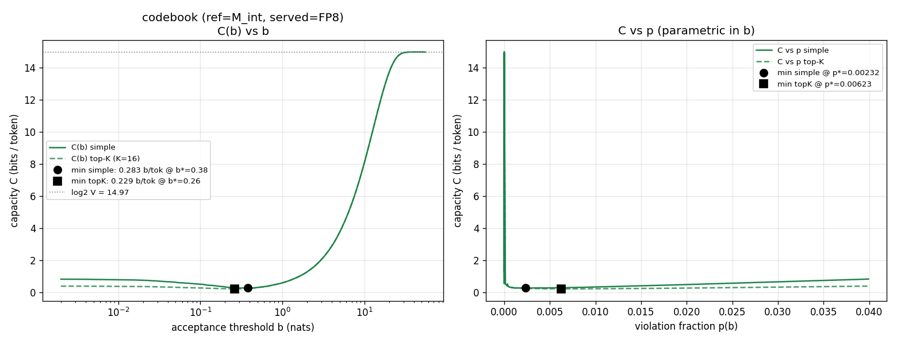
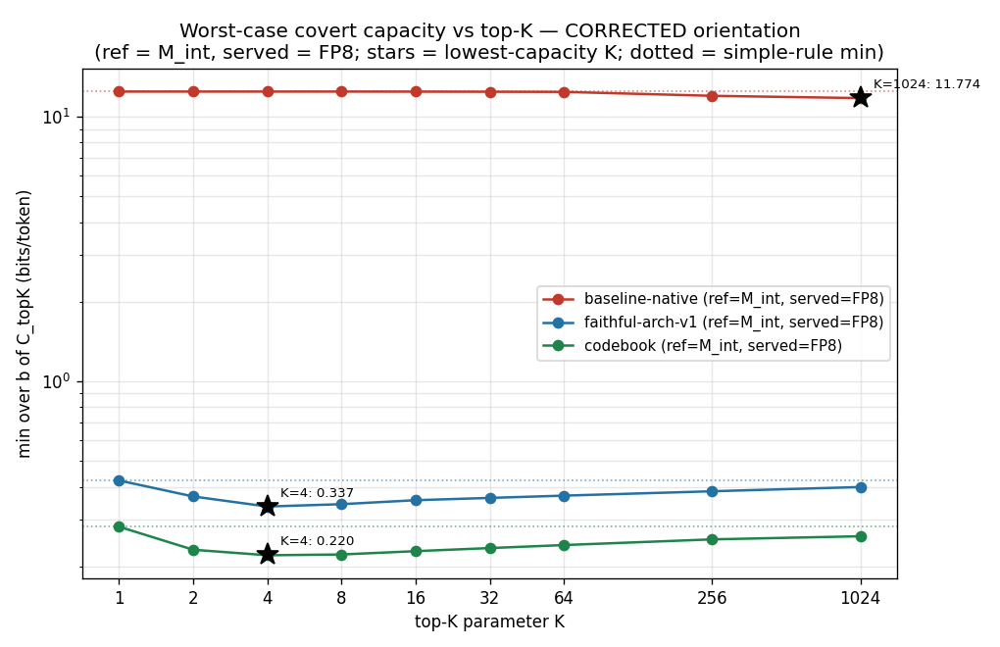

# Covert-channel capacity — CORRECTED threat-model orientation

**What was wrong.** `CAPACITY_SWEEP.md` / `CAPACITY_TOPK.md` computed every margin with
the reference and served roles **swapped** relative to the real threat model: they used
the FP8 teacher as the verifier's reference and M_int's argmax as the served token. In
the actual protocol the datacenter **serves tokens from the fast quantized model (FP8)**
— that is what a network tap observes — while the **ZKP proves the integer model M_int**.
The verifier checks the served FP8 tokens against the *proven* M_int logits within
margin `b`. Corrected roles (everything else — formulas, b-sweep, K-sweep, limit
self-checks, plots — identical in structure):

| role | swapped (old) | corrected (this report) |
|---|---|---|
| reference (verifier's logits) | FP8 teacher | **M_int** (the proven integer model) |
| served token (honest) | argmax of M_int | **argmax of the FP8 fast model** (post-Gumbel) |
| `margin_t` | under FP8's logits, of M_int's token | under **M_int's** logits, of the **FP8-served** token |
| `p(b)` | frac. M_int tokens FP8-rejects at b | frac. FP8 tokens **M_int** rejects at b (the honest violation rate the protocol must tolerate) |
| `N_b(t)` | within-margin count under FP8 scores (scheme-independent) | within-margin count under **M_int** scores (**scheme-dependent**) |
| `cand_rank` / top-K | served token's rank in FP8's ordering | FP8-served token's rank in **M_int's** ordering (the verifier's top-K — the semantically right set) |

Same 8 dolly prompts (`heldout_prompts(20260611)`), same cached FP8 logits
(`/root/zkorch-difr/z_ref_20260611_*.npy`, byte-identical reuse), same Gumbel seeding
`seed+1+pi` at metric temperature 1.0, same 248-point b grid (no extension needed: max
corrected margin 32.7 < 55), same five-term `C_topK` formula and 448-point sweep. M_int
logits were recomputed via the existing `measure/capacity_dump.student_logits` (chains
on CPU, codebook on GPU); training/proving was **not** re-run. The exact post-Gumbel
agreement rate is symmetric by construction, so `p₀` is **identical** to the swapped run
per scheme (0.93408 / 0.06323 / 0.03992) — a built-in cross-check that both runs see the
same logits and noise.

> **Decoding regime + temperature (clarification, 2026-06-13).** These numbers are in the
> **verifiable sampled-decoding regime** (shared-seed Gumbel-max, the DiFR setting): the
> served token is `argmax_v(logits + T·g_σ)` with `g_σ` a public, *committed*-seed Gumbel
> draw — committing the seed is what closes the sampling-randomness channel; this capacity is
> the residual *within the DiFR margin* after that. **All values here are at T = 1** (the
> "metric temperature 1.0" above means `g_σ` enters at scale 1). Greedy decoding is the
> degenerate T→0 limit. `CAPACITY_TEMPERATURE.md` sweeps T and finds the faithful worst-case
> capacity is **~T-insensitive** (0.38–0.45 bits/tok over T ∈ [0.05, 2.0]) and does *not*
> vanish at greedy — the FP8-vs-`M_int` argmax disagreement (~5.5 %) is a deterministic
> integerization gap, not a sampling channel. (Earlier "greedy pinned" wording is corrected
> in `THREAT_MODEL_NOTES.md §0`.)

---

## 1. Headline: corrected vs swapped, side by side

**min over b, bits/token, seed 20260611.** "Coarse" = the 248-point exact grid
(`capacity_analyze*`), matching `CAPACITY_SWEEP.md`'s headline; "448-pt" = grid + dense
refinement (`topk_breakdown*`), matching `CAPACITY_TOPK.md`. Old values reproduced from
the published JSONs, not retyped from the reports.

| Scheme | metric | swapped (old) | **corrected** | Δ |
|---|---|---|---|---|
| **baseline-native** | simple, coarse | 12.099 @ b\*=8.8 (p\*=0.475) | **12.468** @ b\*=7.2 (p\*=0.522) | **+3.0 %** |
| | top-K=16, 448-pt | 12.0704 @ 8.74 | **12.4566** @ 7.25 | +3.2 % |
| | best-K (K=1024) | 11.2805 | **11.7738** | +4.4 % |
| **faithful-arch-v1** | simple, coarse | 0.4585 @ b\*=0.55 (p\*=0.0057) | **0.4325** @ b\*=0.60 (p\*=0.0037) | **−5.7 %** |
| | top-K=16, 448-pt | 0.3612 @ 0.377 | **0.3557** @ 0.465 | −1.5 % |
| | best-K (K=4) | 0.3433 | **0.3367** | −1.9 % |
| **codebook** | simple, coarse | 0.2795 @ b\*=0.29 (p\*=0.0046) | **0.2831** @ b\*=0.38 (p\*=0.0023) | **+1.3 %** |
| | top-K=16, 448-pt | 0.2267 @ 0.283 | **0.2283** @ 0.259 | +0.7 % |
| | best-K (K=4) | 0.2124 | **0.2203** | +3.7 % |

(448-pt simple minima for completeness: baseline 12.463 @ 7.25, faithful 0.4223 @ 0.630,
codebook 0.2824 @ 0.379 — vs swapped 12.0977 / 0.4500 / 0.2785.)

**Corrected headline ratios:** faithful cuts the worst-case channel **~29×** vs baseline
(12.468 → 0.4325 simple; **35×** under top-K=16, 12.457 → 0.356); codebook is a further
**~1.5×** below faithful (0.283). Bits per 1024-token forward pass: ≈ 12 770 / 443 / 290.

---

## 2. Five-component breakdown at the corrected top-K=16 optimum

`C_topK = (a) H(p) + (b) (1−p)·E[log2 N_b] + (c) p·H(q) + (d) p·(1−q)·log2 K +
(e) p·q·log2(V−K)`; components sum to the swept value exactly
(`sum_matches_C_3dp: true` for all three schemes).

### baseline-native — b\* = 7.247, C_topK = **12.4566** (swapped: 12.0704)

p = 0.51807 (4244/8192 violations) · q = 0.99434 (4220/4244 in the tail) · E[log2 N_b] = 7.6995

| component | bits | % (swapped %) |
|---|---|---|
| (a) H(p) — which positions violate | 0.9991 | 8.0 % (8.3) |
| (b) (1−p)·E[log2 N_b] — within-margin multiplicity | 3.7106 | 29.8 % (32.6) |
| (c) p·H(q) — tail-vs-topK choice | 0.0261 | 0.2 % (0.5) |
| (d) p·(1−q)·log2 K — violate into top-K | 0.0117 | 0.1 % (0.3) |
| (e) p·q·log2(V−K) — violate into tail | 7.7091 | **61.9 %** (58.4) |

Still tail-violation-dominated, slightly more so than before: under M_int's reference
ordering the FP8-served tokens sit even deeper in the tail (median violation rank
**2146**, vs ≈185 in the swapped run; max rank over all positions 31 998).

### faithful-arch-v1 — b\* = 0.4654, C_topK = **0.3557** (swapped: 0.3612)

p = 0.00720 (59/8192 violations) · q = 0.0000 (0/59 in the tail) · E[log2 N_b] = 0.2672

| component | bits | % (swapped %) |
|---|---|---|
| (a) H(p) | 0.0616 | 17.3 % (26.3) |
| (b) (1−p)·E[log2 N_b] | 0.2653 | **74.6 %** (60.1) |
| (c) p·H(q) | 0.0000 | 0.0 % (0.0) |
| (d) p·(1−q)·log2 K | 0.0288 | 8.1 % (13.5) |
| (e) p·q·log2(V−K) | 0.0000 | 0.0 % (0.0) |

### codebook — b\* = 0.2593, C_topK = **0.2283** (swapped: 0.2267)

p = 0.00623 (51/8192 violations) · q = 0.0000 (0/51 in the tail) · E[log2 N_b] = 0.1498

| component | bits | % (swapped %) |
|---|---|---|
| (a) H(p) | 0.0546 | 23.9 % (19.2) |
| (b) (1−p)·E[log2 N_b] | 0.1488 | **65.2 %** (72.4) |
| (c) p·H(q) | 0.0000 | 0.0 % (0.0) |
| (d) p·(1−q)·log2 K | 0.0249 | 10.9 % (8.4) |
| (e) p·q·log2(V−K) | 0.0000 | 0.0 % (0.0) |

For both good schemes `q = 0` at the optimum (max FP8-served rank under M_int over **all**
8 192 positions: **5** for both — swapped run saw 5/3), so the violation payload is
`log2 K = 4` bits and the **within-margin multiplicity term (b) dominates**, exactly as in
the swapped run.

---

## 3. U-curves, K-sweep, selected rows

Plots (same construction as before; "corrected" in every filename):









### K sweep (min_b C_topK, 448-pt; q at the optimum in parens)

| K | baseline | faithful | codebook |
|---|---|---|---|
| 1 | 12.4629 / 7.25 (1.000) | 0.4223 / 0.630 (1.000) | 0.2824 / 0.379 (1.000) |
| 2 | 12.4629 / 7.25 (1.000) | 0.3674 / 0.465 (0.271) | 0.2311 / 0.259 (0.196) |
| 4 | 12.4629 / 7.25 (1.000) | **0.3367** / 0.347 (0.026) | **0.2203** / 0.220 (0.043) |
| 8 | 12.4620 / 7.25 (0.999) | 0.3436 / 0.347 (0.000) | 0.2218 / 0.220 (0.000) |
| 16 | 12.4566 / 7.25 (0.994) | 0.3557 / 0.465 (0.000) | 0.2283 / 0.259 (0.000) |
| 32 | 12.4452 / 7.25 (0.986) | 0.3629 / 0.465 (0.000) | 0.2345 / 0.259 (0.000) |
| 64 | 12.4287 / 7.25 (0.973) | 0.3701 / 0.465 (0.000) | 0.2408 / 0.259 (0.000) |
| 256 | 12.0106 / 3.15 (0.631) | 0.3845 / 0.465 (0.000) | 0.2530 / 0.262 (0.000) |
| 1024 | **11.7738** / 4.68 (0.490) | 0.3989 / 0.465 (0.000) | 0.2599 / 0.302 (0.000) |

Same shapes as the swapped run: **faithful/codebook U-shaped in K with the minimum at
K=4**; **baseline monotone decreasing** toward the degenerate K→V limit.

### Selected sweep rows (corrected)

baseline (p₀ = 0.934, corrected reverse-DiFR mean 7.925):

| b | p(b) | E[log2 Nb] | q | C_simple | C_topK |
|---|---|---|---|---|---|
| 0 | 0.93408 | 0.000 | 0.817 | 14.330 | 13.093 |
| 2 | 0.85608 | 2.056 | 0.890 | 13.702 | 13.097 |
| 5 | 0.68079 | 5.337 | 0.980 | 12.796 | 12.743 |
| **7.2** | **0.52222** | **7.648** | **0.994** | **12.468** | **12.462** |
| 15 | 0.09814 | 13.128 | 1.000 | 13.772 | 13.772 |
| 25 | 0.00330 | 14.901 | 1.000 | 14.934 | 14.934 |
| 55 | 0.00000 | 14.966 | — | 14.966 | 14.966 |

faithful (p₀ = 0.063, corrected reverse-DiFR mean 0.01478):

| b | p(b) | E[log2 Nb] | q | C_simple | C_topK |
|---|---|---|---|---|---|
| 0 | 0.06323 | 0.000 | 0.000 | 1.286 | 0.593 |
| 0.1 | 0.04333 | 0.057 | 0.000 | 0.960 | 0.485 |
| 0.3 | 0.01758 | 0.172 | 0.000 | 0.559 | 0.367 |
| **0.6** | **0.00366** | **0.344** | **0.000** | **0.432** | 0.392 |
| 1 | 0.00085 | 0.595 | 0.000 | 0.618 | 0.608 |
| 2 | 0.00000 | 1.269 | — | 1.269 | 1.269 |

codebook (p₀ = 0.040, corrected reverse-DiFR mean 0.005826):

| b | p(b) | E[log2 Nb] | q | C_simple | C_topK |
|---|---|---|---|---|---|
| 0 | 0.03992 | 0.000 | 0.000 | 0.839 | 0.402 |
| 0.1 | 0.02124 | 0.055 | 0.000 | 0.520 | 0.287 |
| **0.38** | **0.00232** | **0.225** | **0.000** | **0.283** | 0.258 |
| 0.55 | 0.00061 | 0.326 | 0.000 | 0.342 | 0.336 |
| 1 | 0.00000 | 0.604 | — | 0.604 | 0.604 |

---

## 4. Did the orientation change the conclusion? **No — quantified:**

1. **Ordering preserved: codebook < faithful ≪ baseline.** Corrected simple minima
   0.283 < 0.433 ≪ 12.47 (swapped: 0.280 < 0.459 ≪ 12.10). Every headline number moved
   by **≤ 6 %** (largest single move: faithful simple −5.7 %; baseline +3.0 %;
   codebook +1.3 %; top-K numbers moved ≤ 3.7 %). The faithful-vs-baseline gap actually
   *widened* slightly: ~29× (was ~26×) simple, ~35× (was ~33×) top-K. The
   codebook-vs-faithful gap narrowed from ~1.6× to ~1.5×.
2. **Term-b dominance for the good schemes: unchanged, slightly stronger for faithful.**
   At the K=16 optimum the within-margin multiplicity term (b) is 74.6 % (faithful, was
   60.1 %) and 65.2 % (codebook, was 72.4 %) of the total; `q = 0` still kills the tail
   terms (c)+(e) outright. Baseline is still tail-violation-dominated: (e) = 61.9 %
   (was 58.4 %), and its violations are now even deeper in the verifier's ordering
   (median rank 2146 vs ≈185).
3. **K-sweep shape: unchanged.** Faithful/codebook U-shaped with min at **K=4** (0.3367 /
   0.2203, was 0.3433 / 0.2124); baseline monotone decreasing, K=1024 endpoint 11.774
   (was 11.281). K=1 still reproduces the simple rule (q ≡ 1) for all schemes.
4. **Limit self-checks: all pass.** `b=0`: swept C equals `H(p₀)+p₀·log2 V` to 4 decimals
   with mean `N₀ = 1.00` for every scheme (14.3298 / 1.2865 / 0.8393). `b→∞` (55 nats):
   C = 14.9658 = `log2 32000` exactly, with `N_b = 32000`. All three curves remain
   genuinely U-shaped with interior minima. Component sums match the swept `C_topK`
   to machine precision.
5. **Why so little changed.** `p₀` is exactly symmetric, and for the good schemes the
   FP8 and M_int post-Gumbel score surfaces are so close (reverse-DiFR means 0.0148 /
   0.0058 vs forward 0.0156 / 0.0060 — asymmetry < 6 %) that flipping which one defines
   margins, `N_b`, and ranks barely moves anything. The baseline is the only scheme with
   visible asymmetry (reverse mean 7.92 vs forward 8.99 nats, max margin 32.7 vs >50),
   which **raises** its corrected capacity (+0.37 bits): margins concentrate at smaller
   values, so at the optimum more positions violate (p\* 0.522 vs 0.475 at a lower
   b\* 7.25 vs 8.8) and 99.4 % of them are free ~15-bit tail picks. Directionally, the
   orientation fix makes the broken baseline look slightly *worse* and the faithful
   scheme slightly *better* — it sharpens, not weakens, the published conclusion.

**One structural caveat the flip introduces** (worth stating even though the numbers
barely moved): under the corrected orientation the **served token stream is identical
across schemes** (always the FP8 argmax under the shared Gumbel draw) and it is the
*reference* that varies by scheme — so the capacity differences are now purely "how
tightly does each proven M_int police the same served stream", which is the right
question for the protocol. In the swapped run both the reference (fixed FP8) and the
served stream (per-scheme) varied, conflating the two.

---

## Caveats (honest)

1. **Small-sample q = 0.** At the K=16 optima q = 0 rests on **59** (faithful) / **51**
   (codebook) violating positions; rule-of-three 95 % upper bounds are q ≤ 0.051 and
   q ≤ 0.059. Worst-casing those adds ≲ 0.005 bits (≈ 1–2 % of the minima). Supporting
   structure: max served-token rank over all 8 192 positions is 5 (both schemes).
2. **Ties** handled exactly as before: `cand_rank` counts strictly-smaller deficits, so
   an exact float tie takes the lowest rank of its tied group (biases q, hence capacity,
   slightly down); `margin = 0` is agreement, never a violation. Post-Gumbel float32
   scores make exact ties beyond rank 0 rare.
3. **The corrected margins are the "reverse DiFR"** (M_int as reference, FP8 as
   candidate). The published DiFR means (8.988 / 0.0156 / 0.0060) are the forward
   direction and were *not* re-derived here; the reverse means (7.925 / 0.01478 /
   0.005826) come out of this dump and are reported above for transparency. A protocol
   verifier that checks served tokens against the proven model computes the reverse
   direction — i.e. THIS one.
4. **Off-grid interpolation** unchanged: p and q exact at every swept b; `E[log2 N_b]`
   linearly interpolated between exact grid points on the 200-point dense refinement
   (step-function bracketing bounds the error as before).
5. **Inherited from the swapped run:** fixed public seed 20260611 (not an official
   round), 8 dolly prompts × 1024 = 8 192 positions (per-token capacities correlated
   across a pass, so ×1024 is an upper bound), Gumbel temperature 1.0 (the DiFR
   metric's), unclamped margins, codebook keeps `lm_head` float (property of the scheme),
   and the Rinberg "realized ≪ theoretical (< 0.5 %)" caveat — these are
   noiseless-channel ceilings, not expected leak rates.
6. `int-model-approximation` was used **read-only**; nothing was committed or pushed.

---

## Reproduce

Scripts in `capacity/`; dumps + results JSON in `capacity/`, plots in this dir.
FP8 logits are the cached `/root/zkorch-difr/z_ref_20260611_{0..7}.npy` (reused
byte-identically); M_int logits recomputed via `measure/capacity_dump.student_logits`.

```bash
cd /workspace/projects/zk-hillclimb/capacity
# 1. corrected per-position dumps (ref = M_int, served = FP8 argmax)
for S in baseline faithful codebook; do
  IMA_TEACHER_KERNEL=fp8_scaled_mm /root/int-model-env/bin/python \
      capacity_dump_corrected.py --scheme $S --seed 20260611
done
# -> capacity_dump_corrected_{scheme}_seed20260611.npz (+ .json metadata)

# 2. C(b) sweep + U-curve plots (imports measure/capacity_analyze.analyze unchanged)
/root/int-model-env/bin/python capacity_analyze_corrected.py --seed 20260611
# -> capacity_corrected_results_seed20260611.json,
#    ../capacity_corrected_{scheme}.png, ../capacity_corrected_combined.png

# 3. top-K breakdown + K sweep (imports capacity/topk_breakdown.Dump unchanged)
/root/int-model-env/bin/python topk_breakdown_corrected.py --seed 20260611
# -> topk_corrected_results_seed20260611.json, ../capacity_corrected_topk_ksweep.png
```

The corrected scripts import the original `analyze()` / `Dump` machinery so the formula
code is byte-identical to the swapped run; only the dump construction (role flip) and
input/output paths differ. Old swapped artifacts (`CAPACITY_SWEEP.md`,
`CAPACITY_TOPK.md`, `measure/capacity_dump_*`, `capacity/topk_results_*`) are left in
place, superseded by this report.
