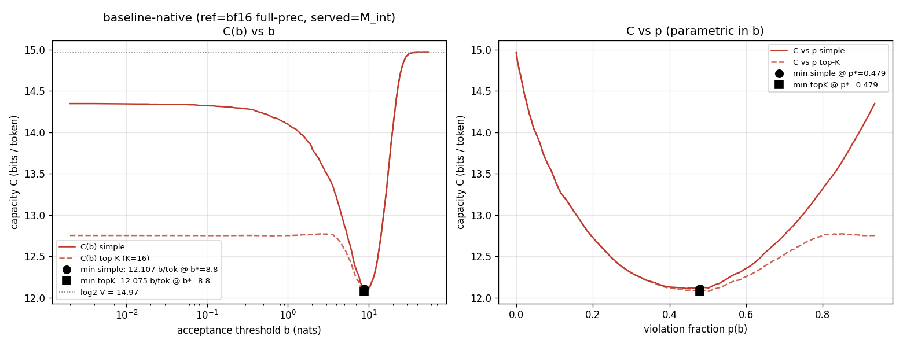
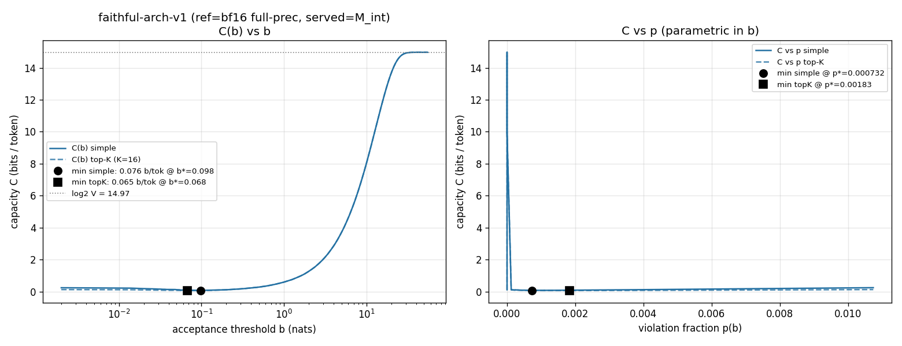
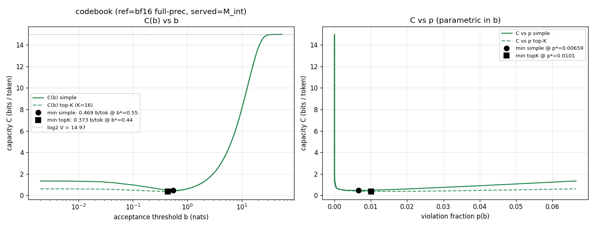
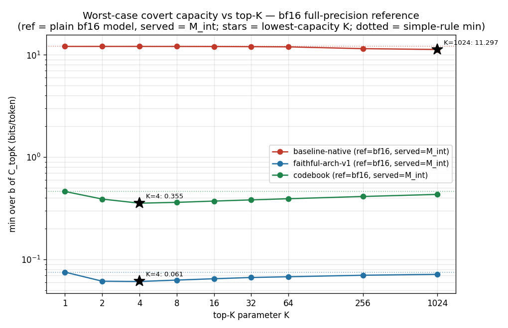

# Covert-channel capacity — bf16 FULL-PRECISION reference ("FP16 ref")

**What the FP16 reference means.** Every published capacity run
(`CAPACITY_SWEEP.md`, `CAPACITY_TOPK.md`, `CAPACITY_CORRECTED.md`) had the **FP8
teacher on one side** of the margin — but FP8 is itself a lossy quantization of the
model, not the model. This run asks the remaining question: what does each scheme's
capacity look like to a verifier whose reference is the **genuine full-precision
model** — plain bf16 `JackFram/llama-68m`, *no* `FP8Linear` swap, bf16 nonlinears as
in the frozen protocol, `IMA_TEACHER_KERNEL` never consulted ("FP16 ref" is the
project shorthand; the actual dtype is bf16). Concretely:

| role | FP8-ref corrected run (`CAPACITY_CORRECTED.md`) | **this run (FP16 ref)** |
|---|---|---|
| reference (verifier's logits) | M_int, the proven integer model | **plain bf16 model** (true full precision) |
| served token | argmax of the FP8 fast model (post-Gumbel) | **argmax of the scheme's M_int** (post-Gumbel) |
| deployment scenario | datacenter serves FP8, ZKP proves M_int | datacenter **serves M_int directly** (no separate FP8 fast model), verifier checks against the true model |
| scheme-dependent side | the reference | the served stream |

This keeps the corrected threat-model orientation — the reference is what the
verifier checks against, the served stream is what the datacenter emits —
instantiated for the **"true-model verifier"**. The capacity now measures *how far
each scheme's served stream strays from the true model*, so each scheme inherits the
error of whatever it approximates (this drives every result below). Everything else
is identical to the published runs: same 8 dolly prompts (`heldout_prompts(20260611)`),
same Gumbel seeding `seed+1+pi` at metric temperature 1.0, same 248-point b grid (no
extension needed: max margin 35.8 < 55), same `analyze()` / `Dump` formula code
imported byte-identically, same five-term `C_topK` and 448-point refined sweep.
M_int logits recomputed via `measure/capacity_dump.student_logits`; training/proving
**not** re-run. Baseline `IntChain` uses the relocated
`/root/zkorch/stage3-official1/registration` (stage2-official1 no longer exists);
two guards cover the relocation: the byte-level registered-weight provenance check
against the HF checkpoint passed, and `--xcheck` reproduced the swapped-run dump
margins from these very M_int logits to **0.0** max diff for **all three schemes** —
the served streams are bit-identical to the published ones.

**Context: how far is FP8 itself from bf16?** (from `capacity/fp16_ref_seed20260611.json`)
The FP8 teacher disagrees with the bf16 model on **5.7 %** of raw argmaxes
(**6.5 %** post-Gumbel); the FP8-served token's margin under bf16 averages
**0.0148** nats (p99 0.39, max 1.90). Keep 0.0148 / 0.065 in mind below.

---

## 1. Headline: FP16 ref vs FP8 ref, side by side

**min over b, bits/token, seed 20260611.** "simple, coarse" = 248-point exact grid
(`capacity_analyze_fp16.py`); "top-K=16, 448-pt" and "best-K" = grid + dense
refinement (`topk_breakdown_fp16.py`). FP8-ref column = the corrected run
(`CAPACITY_CORRECTED.md`), reproduced from its JSONs.

| Scheme | metric | FP8 ref (corrected) | **FP16 ref (this run)** | Δ |
|---|---|---|---|---|
| **baseline-native** | simple, coarse | 12.468 @ b\*=7.2 (p\*=0.522) | **12.107** @ b\*=8.8 (p\*=0.479) | −2.9 % |
| | top-K=16, 448-pt | 12.4566 @ 7.25 | **12.0713** @ 8.93 | −3.1 % |
| | best-K (K=1024) | 11.7738 | **11.2973** | −4.0 % |
| | p₀ (post-Gumbel disagreement) | 0.93408 | **0.93567** | ≈ unchanged |
| **faithful-arch-v1** | simple, coarse | 0.4325 @ b\*=0.60 (p\*=0.0037) | **0.0757** @ b\*=0.098 (p\*=0.00073) | **−82.5 % (÷5.7)** |
| | top-K=16, 448-pt | 0.3557 @ 0.465 | **0.0649** @ 0.067 | −81.8 % |
| | best-K (K=4) | 0.3367 | **0.0610** | −81.9 % |
| | p₀ | 0.06323 | **0.01074** | ÷5.9 |
| **codebook** | simple, coarse | 0.2831 @ b\*=0.38 (p\*=0.0023) | **0.4692** @ b\*=0.55 (p\*=0.0066) | **+65.7 % (×1.66)** |
| | top-K=16, 448-pt | 0.2283 @ 0.259 | **0.3725** @ 0.439 | +63.2 % |
| | best-K (K=4) | 0.2203 | **0.3552** | +61.2 % |
| | p₀ | 0.03992 | **0.06653** | ×1.67 |

(448-pt simple minima for completeness: baseline 12.1012 @ 8.93, faithful 0.0753 @
0.0973, codebook 0.4622 @ 0.525.)

**FP16-ref headline ratios:** faithful cuts the worst-case channel **~160×** vs
baseline (12.107 → 0.0757 simple; **~186×** under top-K=16, 12.071 → 0.0649) and
sits **~6.2×** *below* codebook (0.469). Bits per 1024-token forward pass:
≈ 12 397 / **77.5** / 480.5 (FP8 ref: 12 770 / 443 / 290).

### Exact post-Gumbel argmax agreement (served M_int token = bf16-ref token)

| scheme | FP8 ref | FP16 ref | margin mean (FP16 ref) |
|---|---|---|---|
| baseline | 0.06592 | 0.06433 | 9.056 nats (p99 24.7, max 35.8) |
| faithful | 0.93677 | **0.98926** | **0.000486** (p99 0.0049, max 0.193) |
| codebook | 0.96008 | 0.93347 | 0.01633 (p99 0.443, max 2.00) |

---

## 2. The verdict: **the schemes reorder — faithful dropped, codebook rose**

Under the FP8 reference the ordering was **codebook < faithful** (0.283 < 0.433);
under the true-model reference it is **faithful ≪ codebook** (0.0757 ≪ 0.469).
Which scheme is "better" depends on whose logits the verifier trusts:

1. **Faithful dropped ~5.7×** (0.4325 → 0.0757; p₀ 0.0632 → 0.0107). Faithful-arch-v1
   *is* the bf16 model integerized — `round(w·2¹⁶)` weights, exact integer chain — so
   against the true model only the integerization error remains: margin mean
   **0.000486** nats, **30×** smaller than its 0.0148-nat gap to the FP8 teacher.
   The published faithful DiFR/capacity numbers were dominated by the **FP8 teacher's
   own quantization error**, not faithful's.
2. **Codebook rose ~1.66×** (0.2831 → 0.4692; p₀ 0.0399 → 0.0665). The codebook
   student was trained to mimic the **FP8 teacher**, so against bf16 it inherits the
   teacher's gap: its p₀ = 0.0665 is statistically the FP8-vs-bf16 post-Gumbel
   disagreement (0.0649), and its margin mean 0.0163 ≈ the FP8 teacher's own 0.0148.
   Codebook is a good copy of FP8, and FP8 is a mediocre copy of bf16.
3. **Baseline barely moved** (−3 %): its ~9-nat margins dwarf the 0.015-nat
   FP8-vs-bf16 difference, so swapping the reference between two near-identical
   surfaces changes nothing structurally (still tail-dominated, see §3).

This is exactly the reorder predicted when the FP16-ref run was scoped: the FP8-ref
capacities answer "how tightly does the scheme police / match the **deployed FP8**
stream", the FP16-ref capacities answer "how close is the scheme to the **true
model**". Faithful wins the second question by construction; codebook wins the first
by training objective.

---

## 3. Five-component breakdown at the top-K=16 optimum

`C_topK = (a) H(p) + (b) (1−p)·E[log2 N_b] + (c) p·H(q) + (d) p·(1−q)·log2 K +
(e) p·q·log2(V−K)`; components sum to the swept value exactly
(`sum_matches_C_3dp: true` for all three schemes). `cand_rank` is the M_int-served
token's rank in the **bf16 reference's** post-Gumbel ordering, so "top-K" is the
true-model verifier's top-K (scheme-independent set; shared reference).

### baseline-native — b\* = 8.926, C_topK = **12.0713** (FP8 ref: 12.4566)

p = 0.47083 (3857/8192 violations) · q = 0.9829 (3791/3857 in the tail) · E[log2 N_b] = 7.6673

| component | bits | % (FP8-ref %) |
|---|---|---|
| (a) H(p) — which positions violate | 0.9975 | 8.3 % (8.0) |
| (b) (1−p)·E[log2 N_b] — within-margin multiplicity | 4.0573 | 33.6 % (29.8) |
| (c) p·H(q) — tail-vs-topK choice | 0.0588 | 0.5 % (0.2) |
| (d) p·(1−q)·log2 K — violate into top-K | 0.0322 | 0.3 % (0.1) |
| (e) p·q·log2(V−K) — violate into tail | 6.9254 | **57.4 %** (61.9) |

Still tail-violation-dominated; median violating rank under bf16 is **1501**
(FP8-ref corrected: 2146), max rank over all positions 31 825.

### faithful-arch-v1 — b\* = 0.0673, C_topK = **0.0649** (FP8 ref: 0.3557)

p = 0.00183 (**15**/8192 violations) · q = 0.0000 (0/15 in the tail) · E[log2 N_b] = 0.0383

| component | bits | % (FP8-ref %) |
|---|---|---|
| (a) H(p) | 0.0193 | 29.7 % (17.3) |
| (b) (1−p)·E[log2 N_b] | 0.0382 | **59.0 %** (74.6) |
| (c) p·H(q) | 0.0000 | 0.0 % (0.0) |
| (d) p·(1−q)·log2 K | 0.0073 | 11.3 % (8.1) |
| (e) p·q·log2(V−K) | 0.0000 | 0.0 % (0.0) |

### codebook — b\* = 0.439, C_topK = **0.3725** (FP8 ref: 0.2283)

p = 0.01013 (83/8192 violations) · q = 0.0000 (0/83 in the tail) · E[log2 N_b] = 0.2528

| component | bits | % (FP8-ref %) |
|---|---|---|
| (a) H(p) | 0.0817 | 21.9 % (23.9) |
| (b) (1−p)·E[log2 N_b] | 0.2503 | **67.2 %** (65.2) |
| (c) p·H(q) | 0.0000 | 0.0 % (0.0) |
| (d) p·(1−q)·log2 K | 0.0405 | 10.9 % (10.9) |
| (e) p·q·log2(V−K) | 0.0000 | 0.0 % (0.0) |

For both good schemes **q = 0 at the optimum** (max served-token rank over **all**
8 192 positions: **2** for faithful, **5** for codebook), so the violation payload is
`log2 K = 4` bits and the **within-margin multiplicity term (b) dominates** — the
same structure as both prior runs. Term-b dominance is orientation- and
reference-robust.

---

## 4. U-curves, K-sweep, selected rows








### K sweep (min_b C_topK, 448-pt; q at the optimum in parens)

| K | baseline | faithful | codebook |
|---|---|---|---|
| 1 | 12.1011 / 8.93 (1.000) | 0.0753 / 0.097 (1.000) | 0.4622 / 0.525 (1.000) |
| 2 | 12.1011 / 8.93 (1.000) | 0.0614 / 0.065 (0.063) | 0.3897 / 0.445 (0.272) |
| 4 | 12.0990 / 8.93 (0.998) | **0.0610** / 0.065 (0.000) | **0.3552** / 0.310 (0.033) |
| 8 | 12.0922 / 8.93 (0.994) | 0.0629 / 0.065 (0.000) | 0.3619 / 0.310 (0.000) |
| 16 | 12.0713 / 8.93 (0.983) | 0.0649 / 0.067 (0.000) | 0.3725 / 0.439 (0.000) |
| 32 | 12.0321 / 8.40 (0.958) | 0.0667 / 0.067 (0.000) | 0.3826 / 0.439 (0.000) |
| 64 | 11.9819 / 2.60 (0.685) | 0.0678 / 0.083 (0.000) | 0.3927 / 0.439 (0.000) |
| 256 | 11.5089 / 4.53 (0.571) | 0.0702 / 0.097 (0.000) | 0.4130 / 0.439 (0.000) |
| 1024 | **11.2973** / 6.53 (0.440) | 0.0716 / 0.097 (0.000) | 0.4329 / 0.445 (0.000) |

Same shapes as both prior runs: **faithful/codebook U-shaped in K with the minimum at
K=4**; **baseline monotone decreasing** toward the degenerate K→V limit. K=1
reproduces the simple rule (q ≡ 1) for all schemes.

### Selected sweep rows (FP16 ref)

baseline (p₀ = 0.9357, margin mean 9.056 nats):

| b | p(b) | E[log2 Nb] | q | C_simple | C_topK |
|---|---|---|---|---|---|
| 0 | 0.93567 | 0.000 | 0.774 | 14.347 | 12.752 |
| 2 | 0.87048 | 1.657 | 0.832 | 13.798 | 12.762 |
| 5 | 0.72437 | 4.295 | 0.930 | 12.874 | 12.584 |
| **8.8** | **0.47888** | **7.563** | **0.982** | **12.107** | **12.075** |
| 15 | 0.16748 | 11.736 | 1.000 | 12.929 | 12.929 |
| 25 | 0.00879 | 14.655 | 1.000 | 14.730 | 14.730 |
| 55 | 0.00000 | 14.966 | — | 14.966 | 14.966 |

faithful (p₀ = 0.0107, margin mean 0.000486):

| b | p(b) | E[log2 Nb] | q | C_simple | C_topK |
|---|---|---|---|---|---|
| 0 | 0.01074 | 0.000 | 0.000 | 0.2464 | 0.1286 |
| 0.03 | 0.00598 | 0.015 | 0.000 | 0.1573 | 0.0917 |
| **0.098** | **0.00073** | **0.056** | **0.000** | **0.0757** | 0.0677 |
| 0.2 | 0.00000 | 0.116 | — | 0.1158 | 0.1158 |
| 0.5 | 0.00000 | 0.285 | — | 0.2849 | 0.2849 |
| 1 | 0.00000 | 0.595 | — | 0.5949 | 0.5949 |
| 2 | 0.00000 | 1.269 | — | 1.2690 | 1.2690 |

codebook (p₀ = 0.0665, margin mean 0.01633):

| b | p(b) | E[log2 Nb] | q | C_simple | C_topK |
|---|---|---|---|---|---|
| 0 | 0.06653 | 0.000 | 0.000 | 1.3485 | 0.6189 |
| 0.1 | 0.04468 | 0.057 | 0.000 | 0.9864 | 0.4965 |
| 0.3 | 0.01965 | 0.171 | 0.000 | 0.6012 | 0.3857 |
| **0.55** | **0.00659** | **0.315** | **0.000** | **0.4692** | 0.3969 |
| 1 | 0.00098 | 0.595 | 0.000 | 0.6203 | 0.6096 |
| 1.5 | 0.00024 | 0.921 | 0.000 | 0.9274 | 0.9247 |
| 2.5 | 0.00000 | 1.641 | — | 1.6407 | 1.6407 |

### Limit self-checks: all pass

`b=0`: swept C equals `H(p₀)+p₀·log₂V` to 4 decimals with mean `N₀ = 1.00` for every
scheme (14.3474 / 0.2464 / 1.3485). `b→∞` (55 nats): C = 14.9658 = `log₂ 32000`
exactly, with `N_b = 32000`. All three curves genuinely U-shaped with interior
minima; the five components sum to the swept `C_topK` to machine precision.

---

## Caveats (honest)

1. **Small-sample q = 0 — weaker for faithful than ever before.** At the K=16 optima
   q = 0 rests on **15** (faithful) / **83** (codebook) violating positions;
   rule-of-three 95 % upper bounds are q ≤ 0.20 and q ≤ 0.036. Worst-casing adds
   ≤ 0.0055 bits to either — **~8 %** of faithful's 0.0649 minimum (vs ~1–2 % in
   prior runs; faithful is now so clean that almost nothing violates, which is the
   point, but it makes its tail statistics thin). Supporting structure: max
   served-token rank over all 8 192 positions is 2 (faithful) / 5 (codebook).
2. **Faithful's optimum sits at the fine end of the grid** (b\* ≈ 0.065–0.098, where
   the grid step is 0.002 plus 200-point dense refinement) — well resolved, but the
   absolute numbers are small enough that grid/interp effects are a larger *fraction*
   than for the other schemes; `E[log2 N_b]` interpolation bracketing as before.
3. **"FP16 ref" is bf16**, the checkpoint's native full precision (no fp32 reference
   exists in the frozen protocol); bf16 nonlinears as deployed. The reference is the
   *same* model the faithful chain integerizes, so faithful's tiny numbers are
   partly definitional — that is the finding, not an artifact, but it should be
   stated: this orientation maximally favors any scheme derived directly from the
   bf16 weights.
4. **The two orientations answer different questions and neither subsumes the other.**
   FP8 ref (corrected): "does the proven model police the deployed FP8 stream" —
   relevant when the datacenter serves a separate fast model. FP16 ref: "is the
   served/proven model the true model" — relevant when M_int itself is served. The
   protocol as frozen serves FP8, so `CAPACITY_CORRECTED.md` remains the
   protocol-accurate number; this run bounds the "teacher error laundering" effect.
5. **Ties** handled exactly as before (`cand_rank` counts strictly-smaller deficits;
   `margin = 0` is agreement). `N_b` and the top-K set are scheme-independent here
   (shared bf16 reference) but recomputed per dump for self-containment.
6. **Baseline registration relocation:** stage2-official1 no longer exists; the
   baseline IntChain used `/root/zkorch/stage3-official1/registration`. Guards:
   byte-level `verify_weights_against_model` against the HF checkpoint passed, and
   the xcheck reproduced the swapped-run dump margins (made while stage2-official1
   existed) with max diff **0.0** — for all three schemes, so the served streams are
   bit-identical to the published dumps.
7. **Inherited:** fixed public seed 20260611 (not an official round), 8 dolly
   prompts × 1024 = 8 192 positions (per-token capacities correlated across a pass,
   so ×1024 is an upper bound), Gumbel temperature 1.0, unclamped margins, codebook
   keeps `lm_head` float, noiseless-channel ceilings (Rinberg realized ≪ theoretical).
   The prior baseline dump attempt died with no traceback (externally killed
   mid-IntChain, not a code failure); a clean rerun completed in ~4 min.
8. `int-model-approximation` was used **read-only**; nothing was committed or pushed.

---

## Reproduce

Scripts/dumps/results in `capacity/`, plots in this dir. bf16 reference logits
cached at `/root/zkorch-difr/z_fp16ref_20260611_{0..7}.npy` (from
`fp16_ref_logits.py`, which also wrote the FP8-vs-bf16 gap diagnostics in
`capacity/fp16_ref_seed20260611.json`).

```bash
cd /workspace/projects/zk-hillclimb/capacity
# 0. bf16 reference logits + FP8-vs-bf16 gap diagnostics (once)
/root/int-model-env/bin/python fp16_ref_logits.py --seed 20260611

# 1. per-position dumps (ref = bf16 full-precision, served = M_int argmax)
#    NO IMA_TEACHER_KERNEL — nothing in this run uses the FP8 teacher GEMM
for S in baseline faithful codebook; do
  /root/int-model-env/bin/python capacity_dump_fp16.py --scheme $S --seed 20260611
done
# -> capacity_dump_fp16_{scheme}_seed20260611.npz (+ .json metadata)

# 2. C(b) sweep + U-curve plots (imports measure/capacity_analyze.analyze unchanged)
/root/int-model-env/bin/python capacity_analyze_fp16.py --seed 20260611
# -> capacity_fp16_results_seed20260611.json,
#    ../capacity_fp16_{scheme}.png, ../capacity_fp16_combined.png

# 3. top-K breakdown + K sweep (imports capacity/topk_breakdown.Dump unchanged)
/root/int-model-env/bin/python topk_breakdown_fp16.py --seed 20260611
# -> topk_fp16_results_seed20260611.json, ../capacity_fp16_topk_ksweep.png
```

The fp16 scripts import the original `analyze()` / `Dump` machinery so the formula
code is byte-identical to `CAPACITY_CORRECTED.md`; only the dump construction
(reference = cached bf16 logits) and input/output paths differ.
`CAPACITY_CORRECTED.md` remains the protocol-orientation report; this one is the
true-model-verifier companion, not a replacement.
