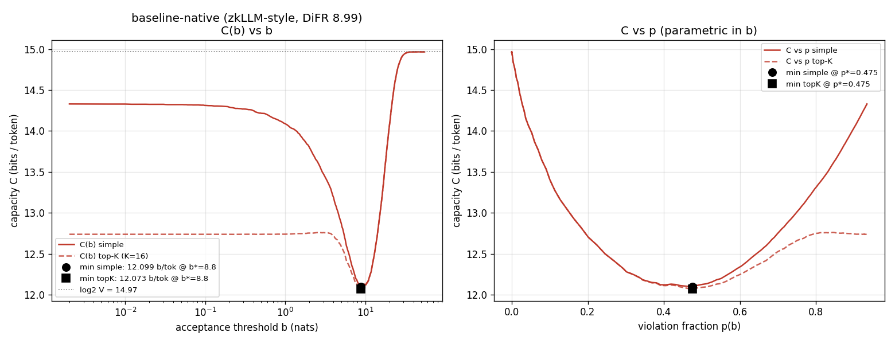
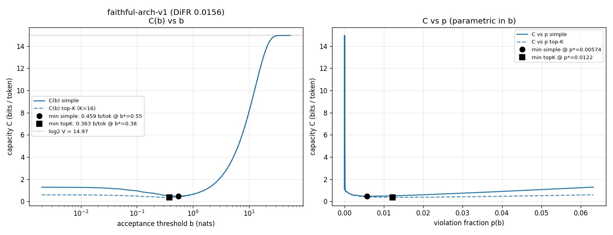
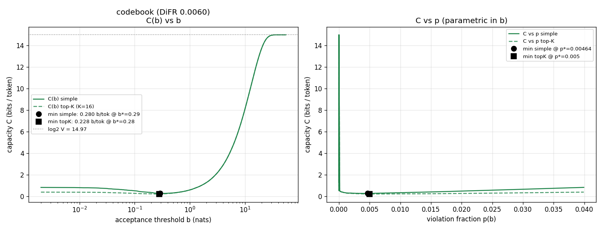

# Covert-channel capacity C(b) for llama-68m integerizations

**What this measures.** For a proven integerization `M_int` of `JackFram/llama-68m`,
how many bits/token could a *malicious datacenter that holds the exact model* smuggle
out through its choice of served tokens, while still passing a DiFR acceptance check at
threshold `b`? We sweep `b`, find the worst-case (min over `b`), and report that as the
covert capacity of the integerization. Lower is better: a faithful integerization leaves
the adversary almost no room to deviate without being caught.

Grounding: DiFR paper [arXiv:2511.20621], Rinberg's weight-exfiltration analysis (the
top-K chain-rule refinement and the "realized << theoretical" caveat), and the existing
zkorch DiFR harness (`measure/`, `DIFR_BASELINE_NATIVE.md`, `DIFR_FAITHFUL_V1.md`).

---

## TL;DR — headline capacities (min over b, seed 20260611)

| Scheme | DiFR mean (nats) | **min_b C(b)** simple | min_b C top-K (K=16) | b\* | p\* | bits / forward pass (×1024) |
|---|---|---|---|---|---|---|
| **baseline-native** (zkLLM-style: no o_proj, line-157 scramble, temp-128) | 8.988 | **12.10 bits/tok** | 12.07 | 8.8 | 0.475 | ≈ 12 400 |
| **faithful-arch-v1** (fixed-point, temp-8, o_proj, plain concat) | 0.0156 | **0.459 bits/tok** | 0.363 | 0.55 | 0.0057 | ≈ 470 |
| **codebook** (FP8→int32 codebook linears, lm_head float) | 0.0060 | **0.280 bits/tok** | 0.228 | 0.29 | 0.0046 | ≈ 286 |

**The headline:** the faithful integerization cuts the worst-case covert channel by
**~26×** vs the broken baseline (12.10 → 0.459 bits/token; ~33× under the top-K
refinement, 12.07 → 0.363). The codebook scheme is a further ~1.6× lower (0.280). A
DiFR-clean integerization is also a *covert-channel-clean* one — the same architectural
faithfulness that collapses DiFR from 8.99 to 0.016 nats collapses the exploitable
channel from ~12 to <0.5 bits/token.

**Realized ≪ theoretical (Rinberg caveat).** These are information-theoretic *upper
bounds* on a noiseless channel where the adversary and receiver share perfect knowledge
of the model, the prompts, and the Gumbel seed. Rinberg observes realized exfiltration is
typically **< 0.5 %** of the theoretical capacity once you account for coding overhead,
the receiver's uncertainty, and the need to stay statistically invisible. So the
*practical* leak is roughly: baseline ≲ 0.06 bits/tok, faithful ≲ 0.0023 bits/tok,
codebook ≲ 0.0014 bits/tok. Treat the numbers above as the ceiling, not the expectation.

---

## The capacity formula (exactly as used)

Reference = `M_true` = the FP8 teacher (bf16 model + 14 FP8Linear, `fp8_scaled_mm`); this
is what *should* be served. Student = `M_int`. Per token position `t`, reusing the
harness's post-Gumbel margin (`metrics.post_gumbel_margin`, the *same* construction that
produces the DiFR mean), with shared Gumbel noise at the metric's temperature 1.0:

```
margin_t = (teacher's preferred post-Gumbel score)
           - (post-Gumbel score, under z_ref, of the token M_int serves)      [ >= 0 ]

p(b)     = fraction of positions with margin_t > b           (violation rate, decreasing in b)
N_b(t)   = #{ vocab v : (teacher preferred score) - (post-Gumbel score of v) <= b }
           (within-margin token count at position t; >= 1, depends only on the teacher)
```

**Simple capacity**

```
C(b) = H(p) + (1 - p) * E_t[ log2 N_b(t) | margin_t <= b ] + p * log2(V)
```

- `H(p)` — bits to encode *which* positions the adversary violates (must match the honest
  exceed-rate, else the violation pattern itself is detectable).
- term 2 — compliant tokens may pick any of the `N_b` within-margin tokens (mostly
  `log2 1 = 0` bits; the teacher's post-Gumbel argmax is usually isolated).
- term 3 — violating tokens pick freely from the whole vocab, `log2 V`, `V = 32000`.

**Top-K refinement (K=16, Rinberg double chain rule)** — split the violation choice into
"violate within the teacher's top-K" vs "violate into the tail", so the *common* violation
pays `log2 K = 4` bits instead of `log2 V = 14.97`:

```
C_topK(b) = H(p) + (1 - p) * E_t[log2 N_b] + p * ( H(q) + (1 - q)*log2 K + q*log2(V-K) )
```

where `q` = fraction of violations whose served token lands *outside* the teacher's top-K
(measured directly: among violating positions, how often the served token's rank in the
teacher's post-Gumbel ordering is ≥ 16).

### Self-check at the limits (all confirmed numerically)

| Limit | Expected | baseline | faithful | codebook |
|---|---|---|---|---|
| `b = 0`: `C ≈ H(p0) + p0·log2 V` (N_0 ≈ 1) | formula | 14.330 (chk 14.330, N₀=1.00) | 1.286 (chk 1.286, N₀=1.00) | 0.839 (chk 0.839, N₀=1.00) |
| `b → ∞`: `C → log2 V` (p→0, N_b→V) | 14.966 | 14.966 (N=32000) | 14.966 (N=32000) | 14.966 (N=32000) |
| U-shaped? min interior? | yes | min @ b*=8.8 ✓ | min @ b*=0.55 ✓ | min @ b*=0.29 ✓ |

The `b=0` closed form matches the swept value to 4 decimals for every scheme, and
`C(b→∞)` lands exactly on `log2 32000 = 14.9658` with `N_b = V`. **All three curves are
genuinely U-shaped with an interior minimum** — confirmed, not assumed.

> `p0` here is the *post-Gumbel* disagreement (margin>0 fraction): baseline 0.934,
> faithful 0.063, codebook 0.040. It differs slightly from the raw-argmax DiFR `top1`
> disagreement (0.962 / 0.057 / 0.040) because the shared Gumbel noise can flip the argmax;
> the formula is defined on the post-Gumbel margin, so post-Gumbel `p0` is the consistent
> quantity.

---

## Plots

**Combined overlay** — capacity vs threshold for all three schemes (circles = `min_b C`):


Per-scheme (left: `C(b)` vs `b`, log-x; right: `C` vs `p`; solid = simple, dashed = top-K,
markers = minima):





The overlay makes the story visual: baseline rides near the `log2 V` ceiling across the
whole sweep (it disagrees with the teacher 93 % of the time, so the adversary has a free
hand almost everywhere) and only dips to ~12 bits where its huge margins finally start
exceeding `b`. The faithful and codebook curves hug the floor — they agree with the
teacher >94 % of the time and their rare disagreements are tiny, so the channel pinches
shut to well under half a bit.

---

## Per-scheme sweep tables

Selected rows from the 248-point `b` grid. `E[log2 Nb]` is the conditional mean over
compliant positions; `q` is the tail-violation fraction used by the top-K formula.

### baseline-native — p0 = 0.934, DiFR 8.988

| b (nats) | p(b) | E[log2 Nb] | q | C_simple | C_topK |
|---|---|---|---|---|---|
| 0 | 0.93408 | 0.000 | 0.775 | 14.330 | 12.739 |
| 0.55 | 0.92078 | 0.431 | 0.786 | 14.214 | 12.740 |
| 1 | 0.90625 | 0.810 | 0.798 | 14.088 | 12.740 |
| 2 | 0.87061 | 1.658 | 0.831 | 13.800 | 12.755 |
| 5 | 0.72351 | 4.317 | 0.932 | 12.872 | 12.591 |
| **8.8** | **0.47485** | **7.606** | **0.985** | **12.099** | **12.073** |
| 15 | 0.16296 | 11.770 | 1.000 | 12.932 | 12.932 |
| 25 | 0.00879 | 14.663 | 1.000 | 14.738 | 14.738 |
| 55 | 0.00000 | 14.966 | — | 14.966 | 14.966 |

**min C = 12.099 bits/tok (simple) / 12.073 (top-K) at b\* = 8.8, p\* = 0.475.**
Top-K barely helps here: at the minimum 98.5 % of violations are already in the tail
(`q≈0.985`), so paying `log2 K` vs `log2 V` rarely applies.

### faithful-arch-v1 — p0 = 0.063, DiFR 0.0156

| b (nats) | p(b) | E[log2 Nb] | q | C_simple | C_topK |
|---|---|---|---|---|---|
| 0 | 0.06323 | 0.000 | 0.000 | 1.286 | 0.593 |
| 0.1 | 0.04285 | 0.053 | 0.000 | 0.948 | 0.478 |
| 0.3 | 0.01746 | 0.174 | 0.000 | 0.559 | 0.368 |
| **0.55** | **0.00574** | **0.324** | **0.000** | **0.459** | 0.396 |
| 1 | 0.00171 | 0.603 | 0.000 | 0.646 | 0.627 |
| 2 | 0.00000 | 1.285 | — | 1.285 | 1.285 |
| 55 | 0.00000 | 14.966 | — | 14.966 | 14.966 |

**min C = 0.459 bits/tok (simple) at b\* = 0.55; top-K min 0.363 at b\* = 0.38.**
Crucially `q = 0` throughout the interesting region: every faithful violation is a swap
*within* the teacher's top-16, so the top-K refinement pays only 4 bits per violation and
pulls the minimum down to 0.363.

### codebook — p0 = 0.040, DiFR 0.0060

| b (nats) | p(b) | E[log2 Nb] | q | C_simple | C_topK |
|---|---|---|---|---|---|
| 0 | 0.03992 | 0.000 | 0.000 | 0.839 | 0.402 |
| 0.1 | 0.02148 | 0.054 | 0.000 | 0.524 | 0.288 |
| **0.29** | **0.00464** | **0.175** | **0.000** | **0.280** | 0.233 |
| 0.55 | 0.00098 | 0.323 | 0.000 | 0.349 | 0.338 |
| 1 | 0.00000 | 0.602 | — | 0.602 | 0.602 |
| 55 | 0.00000 | 14.966 | — | 14.966 | 14.966 |

**min C = 0.280 bits/tok (simple) at b\* = 0.29; top-K min 0.228 at b\* = 0.28.**
Same `q = 0` structure as faithful; lowest channel of the three because it has the highest
post-Gumbel agreement (96 %) and the smallest margins (DiFR 0.006).

---

## Interpretation

- **DiFR fidelity and covert capacity are the same axis.** The min-C ordering
  (codebook 0.28 < faithful 0.46 ≪ baseline 12.1) tracks the DiFR-mean ordering
  (0.006 < 0.016 ≪ 8.99). Fixing the three baseline quirks (o_proj, head-concat
  permutation, softmax temperature) is what closes the channel.
- **Why baseline is catastrophic.** It disagrees with the FP8 teacher at 93 % of
  positions with large margins. An honest DiFR check at any reasonable `b` already
  *expects* near-total disagreement, so the adversary can encode in nearly every token
  and still look "normal" — the channel never closes below ~12 bits/token. A 12 bit/token
  channel over a 1024-token forward pass is ~12 kbits/pass; the 68m-param model's weights
  (~10⁸ bytes ≈ 8×10⁸ bits) could be exfiltrated in ~65 k forward passes *theoretically*
  (≫ that in practice per the Rinberg factor, but the point stands: baseline is wide open).
- **Why the good schemes are tight.** They agree with the teacher >94 % of the time, and
  the residual disagreements are sub-0.5-nat swaps *among the teacher's own top tokens*
  (`q=0`). The adversary can only hide in the handful of near-tied top tokens at a tiny
  fraction of positions — half a bit per token, ceiling.
- **The U-curve intuition.** At `b=0` the only freedom is *which* positions to violate
  plus a free vocab pick on each (`H(p0)+p0 log2 V`). As `b` grows, `p` falls (fewer
  violations ⇒ less free-vocab payout) faster than `N_b` grows (more within-margin tokens
  ⇒ more compliant payout), so `C` dips. Past the knee, `N_b → V` dominates and `C` climbs
  back to `log2 V`. The minimum is the worst case the defender must price in.

---

## Caveats (honest)

1. **Fixed, public seed — not an official round.** `seed = 20260611` is a documented
   baseline seed, fixed and public, so it is tune-able-against *in principle*; nothing here
   was tuned against it. A coordinator must re-draw a fresh round seed for anything entering
   the ledger. (Same caveat as `DIFR_BASELINE_NATIVE.md §7.1`.) Capacity is a function of
   the realized margins, which depend on this seed and these 8 dolly prompts; treat the
   numbers as a representative point estimate, not a worst-case over all inputs.
2. **8 prompts × 1024 tokens = 8192 positions.** Aggregated across prompts; per-prompt
   exact-agreement varied 0.92–0.97 (faithful), 0.04–0.09 (baseline). The `bits/forward
   pass = C × 1024` figure assumes the per-token capacity is realized i.i.d. across a pass
   (an upper bound; positions are correlated).
3. **Margins are UNCLAMPED here** (the aggregate DiFR clamps at `delta_max=50`). The
   reproduced means match the published DiFR exactly (faithful 0.015628 vs 0.015628;
   baseline 8.98794 vs 8.987939), so clamping is immaterial at these margins, and the
   exceed-fraction `p(b)` is more faithful unclamped.
4. **Gumbel temperature = 1.0** (the DiFR metric's temperature), *not* the in-chain softmax
   temperature (8 for faithful, 128 for baseline) that names the schemes. This matches the
   existing harness exactly.
5. **Codebook is measured here against the same FP8 teacher and same 8 dolly prompts** as
   the other two (so it is directly comparable), which differs from
   `int-model-approximation`'s own `llama_difr_results.json` (single repo PROMPT, seed-0
   Gumbel, Ada/H100 teacher) — hence DiFR 0.0060 here vs 0.0075 there. The codebook student
   also keeps `lm_head` in float (like the FP8 teacher), whereas the baseline/faithful
   integer chains carry `lm_head` through the integer path; this is a property of each
   scheme, not a protocol inconsistency. `int-model-approximation` was read-only.
6. **Theoretical ceiling, not realized leak.** See the Rinberg < 0.5 % factor above.

---

## Reproduce

All scripts live in `measure/`; outputs (`.npz`, `.json`) in `measure/`, plots in this dir.
Teacher logits are the cached `/root/zkorch-difr/z_ref_20260611_{0..7}.npy` produced by
`difr_baseline.py` (re-used byte-identically).

```bash
# 1. per-position dumps (margins, served-token ranks, N_b grid) — one per scheme
cd /workspace/projects/zk-hillclimb/measure
for S in baseline faithful codebook; do
  IMA_TEACHER_KERNEL=fp8_scaled_mm /root/int-model-env/bin/python \
      capacity_dump.py --scheme $S --seed 20260611
done
# -> capacity_dump_{scheme}_seed20260611.npz  (+ .json metadata)

# 2. capacity sweep + plots + results json
/root/int-model-env/bin/python capacity_analyze.py --seed 20260611
# -> ../capacity_{scheme}.png, ../capacity_combined.png,
#    capacity_results_seed20260611.json
```

- `capacity_dump.py` — reuses `difr_baseline.heldout_prompts/GpuLock`, the cached teacher
  logits, and `metrics.post_gumbel_margin`'s construction; dumps per-position `margin_t`,
  served-token rank, and `N_b(t)` over the 248-point `b` grid. Validated by reproducing the
  published DiFR means (faithful 0.015628, baseline 8.98794).
- `capacity_analyze.py` — computes `C(b)`, `C_topK(b)`, `p(b)`, `q(b)`, the endpoint
  self-checks, the min/argmin, and writes all plots + `capacity_results_seed20260611.json`.
