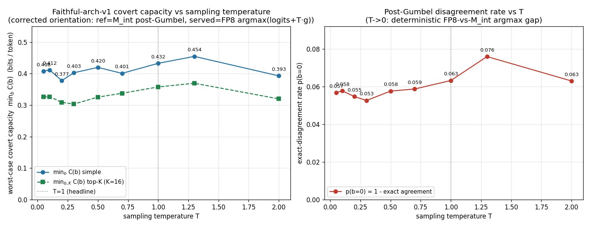

# Covert capacity vs sampling temperature — sensitivity sweep

**Goal.** The headline covert-capacity numbers (`CAPACITY_CORRECTED.md`, `BUFFER_FPR.md`)
are computed at **sampling temperature T = 1** — the post-Gumbel score is `logits + 1·g`.
This report sweeps T and recomputes the worst-case faithful capacity, to quantify how
T-dependent the headline number is and to characterise the greedy (T→0) limit explicitly.

**What "temperature" means here.** The protocol runs in the **verifiable sampled-decoding
regime** (shared-seed Gumbel-max, the DiFR setting): the datacenter samples each token as
`argmax_v(logits[v] + T·g_σ[v])`, with `g_σ` a public function of a **committed** seed σ.
The DiFR metric margin is `logits + T·g`; **T is that one sampling temperature**, applied
**consistently** to BOTH the served-token sampling and the verifier's reference margin / N_b.
Greedy decoding is the **T→0** limit. (See the regime reconciliation in
`THREAT_MODEL_NOTES.md`.)

**Method (corrected orientation, identical to `CAPACITY_CORRECTED.md` except the Gumbel
scale).** Reference = the proven integer model `M_int` (faithful-arch-v1), served = the
deployed FP8 fast model's argmax:

```
post-Gumbel score(v) = logits(v) + T · g_σ(v)         (same g_σ everywhere; seed seed+1+pi)
served token          = argmax_v ( z_fp8(v)  + T·g_σ(v) )
reference (verifier)  = argmax_v ( z_int(v)  + T·g_σ(v) )
margin_t              = max_v(z_int + T·g) − (z_int + T·g)[served_t]      (>= 0, unclamped)
N_b(t)                = #{ v : max_v(z_int + T·g) − (z_int + T·g)[v] <= b }
C(b,K)                = H(p) + (1−p)·E[log2 N_b] + p·(H(q) + (1−q)·log2 K + q·log2(V−K))
```

Fixed across all T: seed **20260611**, the **same 8 dolly prompts** (`heldout_prompts`),
the same byte-identical cached FP8 logits `/root/zkorch-difr/z_ref_20260611_*.npy`, the same
M_int (faithful) logits (recomputed once via `measure/capacity_dump.student_logits`, then
cached), the same 248-point b-grid (extended only if a scheme's margins exceed 55 — they do
not), and the **unchanged** `capacity_analyze.analyze()` (each T is staged as a temp `.npz`
and fed to it, so the capacity math is byte-identical to the headline pipeline). Only `g` is
rescaled by T. **T = 1 reproduces the corrected-faithful headline exactly** (simple 0.4325 @
b\*=0.6, p\*=0.00366; top-K=16 0.3576; p(b=0) = 0.06323) — a built-in regression check.

The task-requested sweep set is **T ∈ {0.3, 0.5, 0.7, 1.0, 1.3, 2.0}**; we additionally
probe **T ∈ {0.05, 0.1, 0.2}** to pin down the near-greedy limit.

---

## Result



| T | simple `min_b C` (bits/tok) | b\* (p\*) | top-K=16 `min_{b,K} C` | b\*ₖ | p(b=0) | margin mean | margin p99 | margin max |
|---|--:|--:|--:|--:|--:|--:|--:|--:|
| 0.05 | 0.4077 | 0.49 (0.0059) | 0.3257 | 0.41 | 0.0568 | 0.01321 | 0.3856 | 1.37 |
| 0.10 | 0.4115 | 0.55 (0.0049) | 0.3264 | 0.41 | 0.0577 | 0.01343 | 0.3963 | 1.40 |
| 0.20 | 0.3775 | 0.48 (0.0051) | 0.3089 | 0.32 | 0.0547 | 0.01218 | 0.3767 | 2.59 |
| 0.30 | 0.4026 | 0.43 (0.0076) | 0.3032 | 0.33 | 0.0526 | 0.01181 | 0.3635 | 2.18 |
| 0.50 | 0.4195 | 0.44 (0.0081) | 0.3253 | 0.40 | 0.0576 | 0.01351 | 0.3952 | 1.52 |
| 0.70 | 0.4006 | 0.50 (0.0056) | 0.3375 | 0.39 | 0.0587 | 0.01366 | 0.4181 | 1.72 |
| **1.00** | **0.4325** | **0.60 (0.0037)** | **0.3576** | **0.47** | **0.0632** | **0.01478** | **0.4212** | **1.88** |
| 1.30 | 0.4545 | 0.50 (0.0065) | 0.3693 | 0.40 | 0.0759 | 0.01680 | 0.4204 | 1.54 |
| 2.00 | 0.3927 | 0.55 (0.0050) | 0.3198 | 0.44 | 0.0630 | 0.01459 | 0.4195 | 1.12 |

(Bold = the T=1 headline, identical to `CAPACITY_CORRECTED.md`. Self-checks at every T:
`b=0` gives `C_simple = H(p0)+p0·log2 V` with mean `N_0 = 1.0`; `b→∞` gives
`C = log2 32000 = 14.966` with `N_b = 32000`.)

---

## What it shows — and why it differs from the naive expectation

**The headline number is essentially temperature-insensitive.** Over the full sweep
T ∈ [0.05, 2.0] — a 40× range spanning near-greedy to hot sampling — the worst-case faithful
capacity stays in **0.38–0.45 bits/token (simple)** and **0.30–0.37 (top-K=16)**, i.e. within
**≈ ±9 %** of the T=1 headline (0.4325 / 0.3576). The dependence is mild and **non-monotone**,
with a shallow peak near **T ≈ 1.3** and a faithful margin-mean that barely moves
(0.012–0.017 nats across the whole range). The reported numbers are **not an artifact of
choosing T = 1** — this *strengthens* the security claim.

**It does NOT vanish at greedy (T→0).** One might expect capacity → 0 as T → 0 because the
*sampling* channel disappears (a deterministic decoder has no RNG freedom to exploit). That
intuition is correct for a **self-consistent** orientation where the verifier's reference
*is* the served model: there, T→0 makes served = argmax = reference's argmax, every margin
collapses to 0, p → 0, and C → 0. **But the protocol-accurate orientation measures two
different models** — the served stream is the **FP8 fast model**, the proven reference is
**`M_int`**. As T → 0 both collapse to their *own* deterministic argmaxes, and those argmaxes
**disagree at ~5.5 % of positions** (p(b=0) → ≈ 0.055 at T = 0.05) purely from integerization
— a **fixed, deterministic model gap**, not sampling noise. The verifier must tolerate a
margin to accommodate that legitimate FP8-vs-`M_int` divergence, and a malicious datacenter
can hide bits inside exactly that tolerance regardless of T. Hence the channel persists at
greedy; temperature only modulates it by a few percent.

**Two channels, separated.** The sweep makes the decomposition concrete:

1. **Sampling-randomness channel** — choosing tokens via the sampler's RNG. This *does*
   vanish as T → 0, and in the verifiable-sampled regime it is closed for all T by the
   **committed seed σ** (the Gumbel draw is public, not adversary-chosen). This is the channel
   `THREAT_MODEL_NOTES §1` flagged as dominating; committing σ is what removes it.
2. **Integerization / model-disagreement channel** — the served FP8 model deterministically
   differs from the proven `M_int`, so the verifier tolerates margin b and bits hide within
   it. **This is what the capacity numbers measure**, and it is ~T-independent (≈ 0.4
   bits/token) and *nonzero at greedy*.

So "greedy → no covert channel" is true only for channel (1). The headline ~0.4 bits/token is
channel (2), the residual after the committed seed closes (1) — and it is robust to T.

---

## Reproduce

```bash
cd /workspace/projects/zk-hillclimb/capacity
IMA_TEACHER_KERNEL=fp8_scaled_mm /root/int-model-env/bin/python \
    capacity_temperature_sweep.py --seed 20260611
# -> capacity_temperature_results_seed20260611.json,
#    z_int_faithful_seed20260611.npz (cached M_int logits),
#    ../capacity_vs_T.png
```

`capacity_temperature_sweep.py` recomputes the faithful `M_int` logits once (FaithfulChain,
CPU, ~5 s/prompt), caches them, then sweeps T as pure GPU arithmetic on the cached
`z_int` / `z_fp8` logits and reuses the unchanged `capacity_analyze.analyze()` for each T.
`int-model-approximation` was used **read-only**; nothing committed or pushed.
