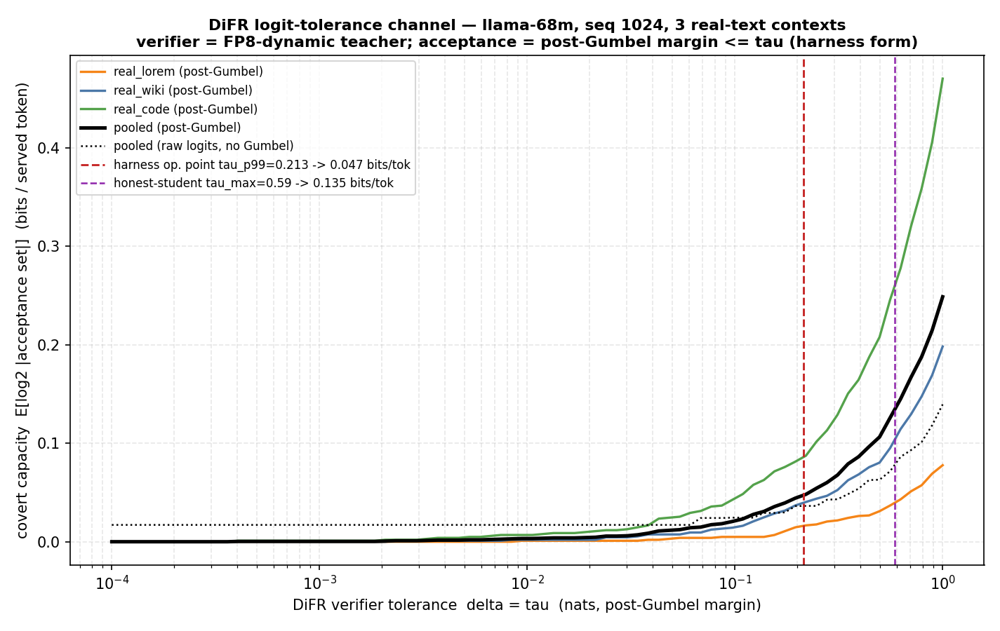

# Token-level covert capacity: the rmsnorm ±1 channel and the DiFR-margin channel

Model `JackFram/llama-68m`, seq 1024 (prefill framing), greedy decoding pinned
(THREAT_MODEL_NOTES.md §1). Three real-text contexts (wiki / lorem / code), same
prompts/tiling as SCORES_RANGE.md. All numbers **measured** unless flagged
`estimate`/`ceiling`. Scripts, seeds and caveats at the bottom.

## Executive summary (5 lines)

1. **rmsnorm ±1 channel — token capacity ≈ 0.001–0.002 bits/token** (constructive
   lower bound 0.0013 b/tok; tightened upper bound ≤0.002 b/tok). The channel's
   entire reach is exact-tie / near-tie tie-breaks; for ≥99.8 % of positions it is
   **provably ~0 bits**.
2. The reason: the **largest logit perturbation** any ±1 choice over all 5 norm
   sites × 1024 rows can produce is **3.2 × 10⁻³ nats** (per-gap optimised: 6.7 × 10⁻⁴),
   ~1000× below the median top-2 margin (3–6 nats). Only positions with margin
   below ~6 × 10⁻³ can flip — 6 of 3072.
3. **DiFR logit-margin channel — capacity 0.047 bits/token (pooled)** at the
   harness operating point τ_p99 = 0.213 nats (per-input 0.017 / 0.039 / 0.084;
   0.135 b/tok at the honest-student τ_max = 0.59).
4. **DiFR dominates the rmsnorm ZK channel by ~25–50×** (0.047 vs ~0.0013 b/tok).
   The tolerance of the *token check*, not the tolerance of the *rmsnorm proof*,
   is where the covert bits live — tightening DiFR matters more than tightening R.
5. Tensor-level freedom the ZK verifier tolerates is **5.0 bits/token** (measured
   mean; ≤7.9 ceiling) — but that is the *proof's* slack, not extractable token
   capacity; the token channel is ~3500× smaller.

| channel | tensor-level freedom | token-level capacity (measured) |
|---|---|---|
| rmsnorm inverse advice R (±1, 5 sites) | 5.0 bits/token (mean) / ≤7.9 (ceiling) | **0.0013 b/tok** (lower) … **≤0.002 b/tok** (upper); ~0 for ≥99.8 % of positions |
| DiFR logit-margin tolerance δ | n/a (defined at logit level) | **0.047 b/tok** @ τ_p99=0.213; 0.135 @ τ_max=0.59 (curve below) |

---

## Setup recap

The five rmsnorm sites confirmed in `m68-pipeline.py` (lines 123–130, 172–179) +
the model's final norm: per layer an `input_layernorm` and a
`post_attention_layernorm` (2 layers → 4), plus `model.norm` = **5 sites**. The
inverse advice enters as `rms_inv_temp.bin` = `1/sqrt(mean(X²)+eps)` scaled by 2¹⁶
(line 127/176); the prover may serve any integer R in the accepted bracket instead
of the exact rounding. We reproduce the zkLLM integer rmsnorm exactly (two
`_rescale` steps, weight at 2¹⁶) in `capacity_lib.IntRMSNorm`, override R per row,
and read out greedy argmax + logits. The 7 linears + lm_head run in float; every
reported number is a **difference** between two R choices through the *same*
pipeline, so the float-vs-fixedpoint discrepancy (~1e-4, SCORES_RANGE.md) is
common-mode and cancels.

---

## Experiment A — rmsnorm ±1 channel → token flips

### A.1 Accepted-set size distribution (exact integer bracket)

Accepted R = integers in `[R*−1, R*+1]` where `R* = sqrt(2⁶⁴·C/M)` (equivalently
`(R−1)²M ≤ 2⁶⁴C ≤ (R+1)²M`). An interval of width 2 holds **exactly 2 integers
generically**, 3 only when R* is (near-)integer:

| accepted-set size | rows (pooled 5 sites × 1024 × 3 inputs = 15360) | fraction |
|---|---|---|
| 2 | 15345 | 99.90 % |
| 3 | 15 | 0.10 % |

Mean **1.0006 bits/row** — i.e. R_round plus **one** neighbour (≈50/50 which side),
not both. **This corrects the threat-model's "~1.6 bits/row":** 1.6 ≈ log2(3) is the
per-row *worst case*; the realised mean freedom is **1.0 bit/row** because the ±1
bracket almost never admits both neighbours.

Tensor-level freedom (trivial ceiling on token capacity):
**5.00 bits/token** (Σ log2(size) = 5123 bits / 1024 tok), or ≤ **7.92 bits/token**
if every row is charged the size-3 worst case (log2 3 × 5 × 1024 / 1024).

### A.2 Baseline greedy tokens + top-2 margins

Per-input top-2 logit margin (nats): min = 0 for all three (one exact tie each —
the BOS position 0, identical logits), medians **6.39 / 4.52 / 3.08**
(lorem / wiki / code). Pooled over 3072 positions: only **6** positions have margin
< 6 × 10⁻³, **17** < 0.05, **58** < 0.2. The bulk sits at margins of several nats.

### A.3a Coarse attacks (all-rows ±1)

Every variant — each site ±1, all sites combined ±1, all-but-final ±1 — produced
**0 argmax flips at any of 1024 positions, on all three inputs.** Max |logit Δ|:

| variant | max |Δlogit| (nats) |
|---|---|
| single site, all rows ±1 | 4×10⁻⁴ … 2.1×10⁻³ |
| **ALL 5 sites combined ±1** | **3.2 × 10⁻³** (global max over all variants/inputs) |

So the *entire* rmsnorm freedom, pushed maximally in one direction across every
row and site, moves any logit by at most **3.2 × 10⁻³ nats**.

### A.3b Targeted attack (50 smallest-margin positions)

For the 50 smallest-margin (input,pos) targets pooled across the 3 inputs: rank the
≤64 most-attended source rows + the target row by single-row influence on the target
top-2 gap (probe one (site,row,±1) at a time), greedily accumulate every
gap-reducing flip, verify the combined R vector with a real forward.

- **Flipped: 4 / 50.** Of these **3 are exact ties** (margin = 0, BOS position 0 of
  each input, flipped with **0** perturbations — a tie-break, not a channel bit).
  **1 genuine flip:** real_code pos 203, baseline margin 2.6 × 10⁻⁴, flipped with a
  5.3 × 10⁻⁴ gap reduction (95 row flips).
- **Max gap reduction achieved over all 50 targets: 6.7 × 10⁻⁴ nats.**
- **Min surviving (un-flipped) margin: 1.9 × 10⁻⁴ nats.**
- **Simultaneity:** all individually-flippable targets per input are flippable from
  **one** merged R vector (0 merge conflicts) — the flips compose into a single
  valid proof.

The search is complete for the channel: the 7th-smallest pooled margin is already
6 × 10⁻³ (≈10× the channel's reach), and everything ranked 7–50 (margins up to
~0.17) survived. Positions ranked >50 have only larger margins. So **≤4 of all 3072
positions are flippable**, 3 of them exact-tie tie-breaks.

> **Bug found and fixed.** The first targeted run reported 20/50 flips with gap
> changes up to −216 nats — impossible (a subset of ±1 flips cannot beat the
> all-rows-combined 3.2×10⁻³ envelope). Cause: `IntRMSNorm` stores **one** global
> baseline R; the script recorded all three inputs up front, leaving `real_code`'s R
> stored, then evaluated lorem/wiki targets (and even their zero-override "baseline"
> forwards) against the wrong input's R — pure garbage. Fix: refresh the recorded
> baseline per input before probing (`exp_a_targeted.py:refresh_baseline`). The
> coarse/baseline script was never affected (it records each input immediately before
> use). Numbers above are post-fix.

### A.4 Capacity estimates (rmsnorm channel)

**LOWER bound (constructive, honest).** From one valid R choice the adversary can
realise the flips actually achieved, all simultaneously: 4 flippable positions over
3072 → **0.0013 bits/token** pooled. Stripping the exact-tie tie-breaks (which need
no channel and aren't "served" generated tokens), the genuine constructive content is
**1 flip / 3072 ≈ 0.0003 bits/token**.

**UPPER bound (tightened, information-theoretic).** A position's argmax can change
only if its top-2 margin is below the channel's maximum reach on that gap. Measured
envelopes: max single-logit |Δ| = 3.2×10⁻³ (coarse, all rows one way) ⇒ max |Δgap|
≤ 2×3.2×10⁻³ = 6.4×10⁻³; per-gap-optimised reach = 6.7×10⁻⁴ (targeted). Every
position with margin > 6.4×10⁻³ is therefore unflippable **within the measured
perturbation envelope**. Pooled, 6/3072 = 0.20 % of positions clear that bar, each
worth ≤ log2 2 = 1 bit ⇒ **≤ 0.002 bits/token**. Because max |Δlogit| (3.2×10⁻³) is
~1000× below the median margin and below all but 0.2 % of margins, the channel is
**provably near-0 for ≥99.8 % of positions** — the proven-near-0 argument the task
asks for. (Caveat on "proven": the envelope is measured over the real ±1 brackets and
the per-row optimiser, not derived analytically for every one of the 2^5120 R
combinations; it is an empirical max, corroborated by two independent attacks.)

Both bounds agree: **rmsnorm token-channel ≈ 0.001–0.002 bits/token**, essentially
all tie-break artifacts.

---

## Experiment B — DiFR logit-tolerance channel (the δ-curve)

**Acceptance form actually used by the harness is NOT raw "logit within δ of
argmax".** `harness/score.py` scores `metrics.post_gumbel_margin` and
`results/llama_pareto/acceptance_bits.py` defines the channel as a **post-Gumbel
margin** test: with shared Gumbel noise g (seed 0) on the verifier/teacher
(FP8-dynamic) logits z_ref,

    accept token t  ⇔  (z_ref+g)[argmax] − (z_ref+g)[t]  ≤  τ ,

so the capacity at tolerance τ is `C(τ) = E_pos[ log2 |{t : margin_t ≤ τ}| ]`. We
compute C(τ) for τ ∈ [1e-4, 1.0] log-spaced (80 pts) on the FP8 teacher logits of
the three real-text contexts, per input and pooled, and also the **raw-logit** form
the task's B.1 literally describes, for comparison.

**Operating point.** The verifier must tolerate honest-student error, so τ is pinned
to the honest-student post-Gumbel margin floor (acceptance_bits.json):
τ_p99 = **0.213** nats (zkllm_native; codebook 0.233), τ_max = **0.590** nats.

### δ-curve (pooled, bits/token)

| δ = τ (nats) | post-Gumbel (harness form) | raw-logit | frac. positions with >1 accepted token |
|---|---|---|---|
| 1e-4 | 0.0000 | 0.0171 | 0.0000 |
| 1e-3 | 0.0003 | 0.0171 | 0.0003 |
| 1e-2 | 0.0033 | 0.0171 | 0.0033 |
| 0.05 | 0.0116 | 0.0171 | 0.0114 |
| 0.10 | 0.0206 | 0.0244 | 0.0202 |
| **0.213 ← op τ_p99** | **0.047** | 0.036 | 0.046 |
| 0.50 | 0.106 | 0.063 | 0.094 |
| **0.590 ← τ_max** | **0.126** | 0.072 | 0.110 |
| 1.0 | 0.249 | 0.140 | 0.197 |

Per-input at τ_p99: lorem 0.017, wiki 0.039, code 0.084 bits/token (pooled 0.047).
At τ_max: lorem 0.039, wiki 0.102, code 0.264 (pooled 0.135).



(The raw-logit curve has a spurious floor of 0.017 b/tok as δ→0 — exact top-2 logit
ties from the tiled identical contexts. The post-Gumbel form the harness uses breaks
those ties with continuous noise and correctly →0, which is why it is the right
metric; we report both and use post-Gumbel for the operating point.)

---

## Which channel dominates

**DiFR dominates.** At the harness operating point the token-check tolerance leaks
**0.047 bits/token** (pooled; up to 0.084 on code), whereas the rmsnorm ZK freedom
leaks **~0.0013 bits/token** — a **25–50× gap**. The covert capacity of this system
is set by the *logit-margin tolerance of the token check*, not by the *±1 slack of
the rmsnorm proof*. Implication for the hill-climb: tightening DiFR (smaller honest
τ_p99) buys more security than tightening the R bracket, and the rmsnorm channel can
be treated as ~0 in the capacity-budget table.

For scale, both are dwarfed by the out-of-scope sampling channel (§1): ~entropy of
the output distribution, ~several bits/token.

---

## Honest caveats

- **Tiled-text artifacts.** The 3 contexts are tiled to fill 1024 tokens (per
  SCORES_RANGE.md). Repetition manufactures exact/near-ties (the 3 BOS ties; the code
  pos-203 near-tie at period-80 repetition). Natural non-repeating text would have
  **fewer** ties, so the rmsnorm 0.0013 b/tok is, if anything, an **over**-estimate.
  The DiFR curve is also mildly inflated at small δ by the same ties.
- **"Proven near-0" is empirical-envelope, not analytic.** The ≤0.002 b/tok upper
  bound rests on the measured max perturbation (3.2×10⁻³) over the real brackets plus
  a per-gap optimiser, not a closed-form bound over all 2^5120 R vectors. Two
  independent attacks (coarse all-rows, targeted per-row greedy) agree.
- **Float linears.** Channel deltas cancel the float/fixed-point gap (common-mode);
  the absolute baseline logits are float, not the zkLLM int student. A fixed-point
  re-run would shift baseline margins by ~1e-4, far below any conclusion's threshold.
- **Operating point provenance.** τ_p99=0.213 / τ_max=0.59 are from
  `acceptance_bits.json` (repo dev prompt). The held-out DiFR τ per round (score.py)
  is drawn fresh; the capacity at that τ is read off this same curve. The repo-prompt
  acceptance_bits gives 0.19 b/tok at p99 vs our 0.047 on wiki/lorem/code — same
  order, input-dependent; both are "a small fraction of a bit."
- **Scale.** llama-68m only. Larger models → sharper logits (larger margins) likely
  shrink the rmsnorm channel further and move the DiFR curve; a cost-model
  extrapolation belongs in the writeup, not measured here.

---

## Exact commands / scripts / seeds

Env: `/root/int-model-env/bin/python` (torch 2.7.1+cu128, transformers 4.57.3,
RTX 4090), model `JackFram/llama-68m` from
`zk-hillclimb/zkllm-src/model-storage`. Nothing under `int-model-approximation` or
`zkllm-src` was modified. Seeds: Gumbel = 0 (matches acceptance_bits.py / score.py
protocol); inputs are the fixed deterministic texts in `capacity_lib.PROMPTS`; R
perturbations are deterministic. `m68-pipeline.py` was read only.

Scripts under `zk-hillclimb/capacity-measure/`:

```bash
cd /workspace/projects/zk-hillclimb/capacity-measure
# A.1 / A.2 / A.3a  -> exp_a_results.json
/root/int-model-env/bin/python exp_a_baseline_coarse.py
# A.3b targeted     -> exp_a_targeted_results.json   (post-fix)
/root/int-model-env/bin/python exp_a_targeted.py
# B  delta-curve    -> exp_b_results.json + difr_delta_curve.png
IMA_TEACHER_KERNEL=fp8_scaled_mm /root/int-model-env/bin/python exp_b_difr_curve.py
```

- `capacity_lib.py` — exact integer rmsnorm with per-row R override; 5 sites;
  `build_model` uses `attn_implementation="eager"` (so `output_attentions` works for
  the targeted attack's attention-influence ranking).
- `exp_a_baseline_coarse.py` — accepted-set histogram, baseline argmax+margins,
  coarse all-rows ±1 variants.
- `exp_a_targeted.py` — per-input baseline refresh + greedy per-row flip search +
  simultaneity check.
- `exp_b_difr_curve.py` — FP8 teacher logits (`llama_difr.replace_linears`),
  post-Gumbel + raw acceptance curves, operating-point marks, PNG.
- Raw outputs: `exp_a_results.json`, `exp_a_targeted_results.json`,
  `exp_b_results.json`; plot `difr_delta_curve.png` (also copied next to this file).
```
