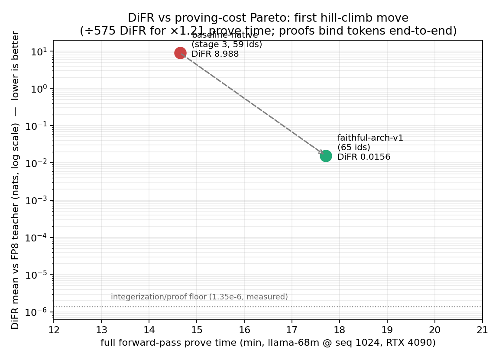
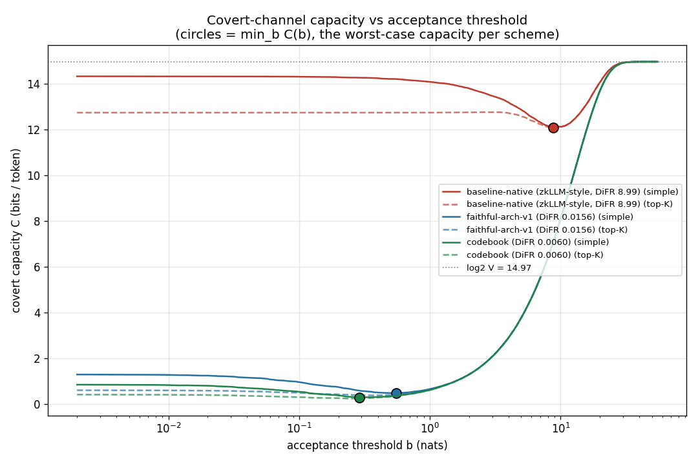
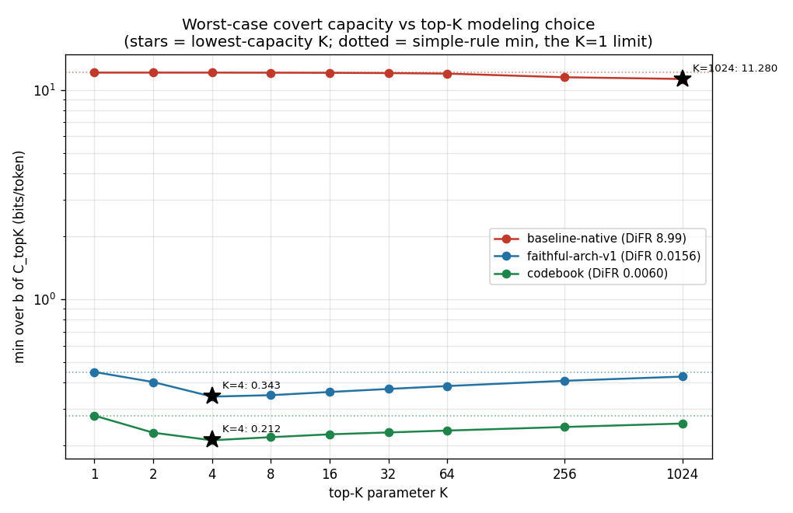
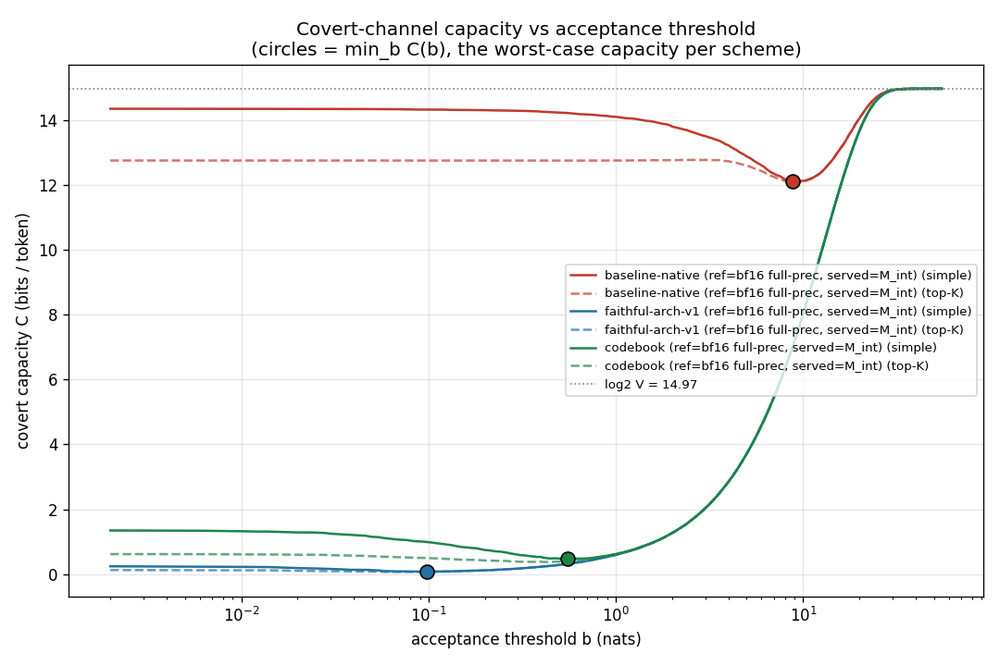
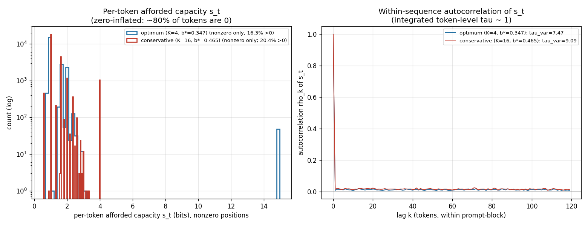
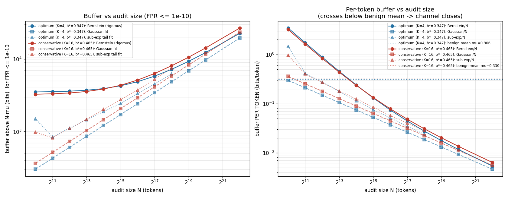

# Proving served tokens came from a committed model — and measuring what that leaves leaky

*Technical report. All numbers are pulled from the committed source docs in this repo; nothing is
estimated. Scale throughout is `JackFram/llama-68m` at sequence length 1024 (prefill framing), RTX
4090. "Not measured" is stated where a number does not exist.*

## Executive summary

A datacenter wants to prove to an external verifier that the tokens it served came from a specific
**committed** model, without revealing the model's weights. We built that system end-to-end (prove →
serialize → verify, with weight privacy) and then measured the one thing such a proof cannot remove:
the slack between the committed integer model and the tokens actually emitted is a **covert channel**,
and its width is the real security number. Four headline results:

1. **The proof machinery is essentially free; faithfulness is what matters.** Decomposing the
   token-fidelity metric (DiFR), the entire integerization + proof pipeline costs **1.35×10⁻⁶ nats**
   (p99 exactly 0). A model revision that fixed three architectural quirks moved end-to-end DiFR from
   **8.99 → 0.0156 nats (÷575)** — the gap was architecture, never the proofs.
2. **Faithfulness is also what closes the covert channel.** Worst-case covert capacity tracks DiFR:
   the broken baseline affords **~12.5 bits/token**, the faithful model **~0.36**, a codebook variant
   **~0.23** (vs the deployed FP8 stream). ~70 % of the residual is the *model's own near-ties*, not
   adversarial violations.
3. **We rebuilt the proof transport to be practical and weight-private.** Verify dropped
   **999.5 s → 27.1 s (36.9×)**, prove **1062 s → 522 s (2.03×)**, with real hidden-weight commitments
   that no comparable system implements. An independent soundness audit found it **SOUND**.
4. **A single audit certifies nothing.** The benign channel is **0.306 bits/token**, but cumulative
   variance grows **~7.5× faster than i.i.d.** (strong between-prompt heterogeneity, N_eff ≈ N/7.5).
   Holding a false-shutdown rate < 1e-10 needs **thousands of tokens across many distinct prompts**.

---

## 1. Threat model and framing

The system proves that **committed weights applied to public inputs produce specific logits**. The
network observer, however, sees **tokens**, so the logit→token link is part of the threat model:

- **Verifiable sampled decoding (shared-seed Gumbel-max) is the regime.** The served token is
  `argmax_v(logits[v] + T·g_σ[v])`, where `g_σ` is a public Gumbel draw from a **committed** seed σ;
  the verifier reconstructs the post-Gumbel scores from the *proven* logits and the committed seed and
  checks each served token's margin against them. **Committing σ is load-bearing:** a free sampler RNG
  would be a steganographic channel of ~entropy(distribution) bits/token that dwarfs everything the ZK
  layer controls — committing the seed (equivalently, proving `tokens = argmax(logits + T·g_σ)`) closes
  that channel, and the measured capacity is the *residual within the DiFR margin* after it is closed.
  **Greedy is the T→0 special case** (no sampler freedom), not a separate model. All headline capacity
  numbers are at **T=1**; the worst-case faithful capacity is **nearly T-independent** (±9 % over
  T ∈ [0.05, 2.0], §3.2 / `CAPACITY_TEMPERATURE.md`) and notably does *not* vanish at greedy, because
  the served FP8 stream and the proven `M_int` deterministically disagree at ~5.5 % of positions.
- **Integerization error *is* the covert-channel capacity.** Every tolerance the verifier must accept
  is converted to *bits per served token extractable by an observer*. Two distinct numbers are
  reported per channel: the **tensor-level freedom** the verifier tolerates (the proven ceiling) and
  the **token-level capacity** an adversary can push through argmax. The zero-advice obligations make
  most ceilings provably zero: **softmax 0, rescale remainders 0, matmul/skip/glu 0**; the rmsnorm
  inverse-advice bracket is a proven **≤ 1.6 bits/row** ceiling. The token check's tolerance δ is itself
  a channel and competes in the same budget.
- **Afforded ≠ detected ≠ transmitted.** Every capacity number is a *noiseless-channel ceiling* — the
  worst case an adversary holding the exact model could embed while perfectly mimicking the honest
  margin/rank profile. It is not an expected or realized leak (Rinberg: realized ≪ theoretical,
  < 0.5 %).

---

## 2. The ZKP system

**What the prior art was.** We built and ran the three transformer-scale zkML systems
(DeepProve, JOLT Atlas, zkGPT) and inspected two more. The finding (BACKEND_DECISION): **nobody has
implemented weight privacy.** All use deterministic, non-hiding commitments and ship weight-polynomial
evaluations at Fiat–Shamir points to the verifier in plaintext — the same leakage class as our own
stack; JOLT Atlas hands the verifier the entire model. DeepProve's decisive advantage —
**verify 2.33 s, proof 10.25 MB** (GPT-2 seq 64) vs our then-current 999.5 s / 175.6 MB — comes from
*batching architecture* (claim chaining + one batched PCS opening), not a faster protocol family; its
prove throughput (~1 s/token) is the same ballpark as ours. But its nonlinearities accept **error
bands** (the exact prover-freedom class this project exists to close), its quantization is
float-calibrated (would destroy the 1.35e-6 DiFR floor), and its license flipped to proprietary
eval-only. **Decision: keep our stack, port the batching architecture.**

**What we built.** A full prove/serialize/verify pipeline over row-wise **Pedersen commitments
(BLS12-381)**, with: per-tensor commitments enabling **byte-equality activation chaining** and
**homomorphic affine links**; **zero-advice obligations** that close the covert channels above; and
(Stage D) **weight privacy** — hiding Pedersen registration, hidden weight claims with committed-round
sumchecks, and a ZK blinded-IPA opening, so no weight-MLE evaluation is recoverable from any artifact
(leak scan CLEAN, with a planted-plaintext positive control).

**The efficiency rebuild.** Each driver now *emits* its terminal claims into a shared accumulator, and
one batched RLC opening per generator domain discharges the lot, replacing ~1,535 inline IPA openings
(≈ 90 % of the old verify wall). Combined with a single-process verifier (DriverPool) and batched
GPU fold/IPA helpers:

| metric | inline (before) | **batched (after)** | speedup |
|---|--:|--:|--:|
| prove wall | 1062 s | **522.0 s** | 2.03× |
| verify wall | 999.5 s | **27.1 s** | **36.9×** |
| proof size | 175.6 MB | 176.3 MB | 1.0× |

Weight privacy is wired into the full walk on top of this at **+0.94 % prove, +3.4 s verify,
+0.08 MB** (wprivtest: 20/0 ACCEPT, walk-scale leak scan CLEAN). An **independent as-built soundness
audit** rejected every constructed forgery at its correct named locus and rated **(a) batching SOUND,
(b) weight privacy SOUND, (c) per-id tamper localization SOUND**; the three protected transcript
headers are byte-identical to baseline. Two residual leaks are **statement-layer, documented, and
confined** (the rmsnorm gain g is recoverable from the public `W = R⊗g` chain tensor; candidate
guess-and-confirm against deterministic activation commitments) — neither is a proof-layer hole.

*Caveat:* the proof is still **176 MB** — the **S1 re-layout** (canonical-affine + content-dedupe,
designed target ~45 MB ≈ 3.9× smaller) was **designed but deferred, not implemented**; verify/proof
trade-offs for it are *not measured*. Proof size remains ~17× DeepProve's; we keep the larger proof in
exchange for per-tensor auditability, homomorphic links, and the weight privacy nobody else has.

---

## 3. Results

### 3.1 DiFR: the proof machinery is free; the gap is architecture

DiFR (post-Gumbel logit-margin vs the frozen FP8 teacher, 8 held-out dolly prompts) decomposes cleanly
by inserting a float64 replica of the exact function the chain integerizes:

| metric | baseline-native (stage 2) | **faithful-arch-v1** | ratio |
|---|--:|--:|--:|
| difr_mean | 8.988 | **0.0156** | **÷ 575** |
| difr_p99 | 23.996 | 0.422 | ÷ 57 |
| top-1 agreement | 0.0383 | **0.943** | — |
| argmax flips | 7878/8192 (96.2 %) | 464/8192 (5.7 %) | ÷ 17 |
| **chain vs float replica** (integerization only) | **2.4e-6**, p99 0.0 | **1.35e-6**, p99 0.0 | — |

The chain-vs-replica leg is the load-bearing finding: the entire integer + proof pipeline drifts from
its real-valued target by **1.35×10⁻⁶ nats**, p99 exactly 0 — three orders below any architecture
effect. The 8.99-nat baseline gap was **entirely three frozen-pipeline quirks** (no o_proj applied, a
head-concat permutation scramble, softmax temperature 128 instead of 8). Faithful-arch-v1 fixes all
three; the remaining 0.0156 is the FP8-teacher-vs-float-architecture residual any faithful student
carries, not anything the proofs added. Both chains validate **byte-exactly** against driver-emitted
witness files (33/33 and 334/334 tensors).

The DiFR gain is therefore **architectural, not a tighter rounding** (roundings are already at the
floor). The faithful walk's prove cost is **not officially timed** (no coordinator round has been run;
LEDGER is empty) — the transport-rebuilt faithful walk measures **522 s** prove / 27.1 s verify (§2),
but a HARNESS-protocol official timing remains the standing gap.

### 3.2 Covert-channel capacity sweeps

Capacity is `min_b C(b)`, with the five-term top-K rule `C_topK = H(p) + (1−p)·E[log₂ N_b] +
p·(H(q) + (1−q)·log₂K + q·log₂(V−K))`. In the **protocol-accurate orientation** (reference = the
proven integer model M_int, served = the deployed FP8 fast model's argmax):

| scheme | simple `min_b C` (bits/tok) | top-K=16 (bits/tok) |
|---|--:|--:|
| baseline-native | 12.468 | 12.457 |
| faithful-arch-v1 | 0.4325 | 0.356 |
| codebook | 0.2831 | 0.228 |

Faithful cuts the worst-case channel **~29×** vs baseline (~35× under top-K); codebook is a further
~1.5× below faithful. The same faithfulness that bought the DiFR move buys the capacity collapse.

**~70 % of the residual is the model's own near-ties, not violations.** For both good schemes `q = 0`
at the optimum (the FP8-served token never sits outside M_int's top-5), so the violation payload
collapses to `log₂K = 4` bits and the dominant term is the **within-margin multiplicity** `(1−p)·E[log₂
N_b]` — **74.6 %** (faithful) / **65.2 %** (codebook) of the total. The residual channel is mostly
"which of the model's own near-tied top tokens do you pick", not "violate". The baseline, by contrast,
stays tail-violation-dominated (term (e) = 61.9 %; median violation rank 2146).

The K-sweep is **U-shaped for the good schemes with a floor at K=4** (faithful 0.337, codebook 0.220)
and **monotone-decreasing for the broken baseline** (11.77 at K=1024) — the baseline's disagreements
are spread across the whole vocabulary, so refinement cannot help it.

**The FP16 reorder.** Re-pointing the verifier's reference at the *true* full-precision bf16 model
(served = each scheme's own M_int) **reorders the schemes**:

| scheme | FP8 ref (simple) | **FP16 ref (simple)** | Δ |
|---|--:|--:|--:|
| baseline-native | 12.468 | 12.107 | −2.9 % |
| faithful-arch-v1 | 0.4325 | **0.0757** | **÷ 5.7** |
| codebook | 0.2831 | **0.4692** | **× 1.66** |

Faithful-arch-v1 **is** the bf16 model integerized, so against the true model only integerization error
remains (margin mean **0.000486** nats, 30× smaller than its gap to FP8). Codebook was *trained to mimic
FP8*, so against bf16 it inherits the FP8 teacher's own 6.5 % quantization gap. The lesson: "best
integerization" depends on which model the threat is defined against — and both orientations agree
faithful ≪ baseline and that term (b), the near-ties, dominates. (`CAPACITY_CORRECTED.md` remains the
protocol-accurate report since the deployment serves FP8; the FP16 run bounds the "teacher-error
laundering" effect.)

**Temperature sensitivity (the headline is at T=1).** Capacity is measured in the verifiable sampled
regime (post-Gumbel score `logits + T·g_σ`); the headline numbers use **T=1**. Sweeping the sampling
temperature for the faithful scheme (corrected orientation, same seed/prompts) leaves the worst-case
capacity **nearly flat — 0.38–0.45 bits/tok (simple), 0.30–0.37 (top-K=16) over T ∈ [0.05, 2.0]**,
within ±9 % of the T=1 value and mildly non-monotone (a shallow peak near T≈1.3). Crucially it does
**not** vanish at greedy (T→0): the served FP8 stream and the proven `M_int` deterministically disagree
at ~5.5 % of positions (an integerization gap), so the residual-margin channel persists independent of
T — the sampling-randomness channel that *would* vanish at T→0 is the one already closed by committing
the Gumbel seed. The headline ~0.4 bits/token is therefore robust to the decoding temperature, not an
artifact of T=1 (`CAPACITY_TEMPERATURE.md`).

![Faithful covert capacity vs sampling temperature: ~flat over T∈[0.05,2.0], does not vanish at greedy](capacity_vs_T.png)

### 3.3 The treaty: buffer vs false-shutdown rate vs audit size

The operational model: a ZKP proves M_int's post-Gumbel logits, taps observe served FP8 tokens, and a
treaty tears up when the cumulative *afforded* budget exceeds `N·μ + buffer(N)`. The buffer must keep
an **honest** datacenter from wrongful shutdown at FPR < 1e-10.

At the calibrated optimum (K*=4, b*=0.347) the benign mean is **μ = 0.306 bits/token** (conservative
K=16: 0.330). The per-token distribution is **heavily zero-inflated — ~80 % of tokens afford 0 bits**
(the served token *is* M_int's preferred token, alone within margin).

**The key correction to "assume i.i.d." is between-prompt heterogeneity.** Token-level autocorrelation
is negligible (τ_acf ≈ 1.15), but the **session-level variance inflation is τ_var = 7.47 (K=4) /
9.09 (K=16)**: summed over a 1024-token prompt the variance grows ~7.5× faster than i.i.d., because
per-prompt difficulty ranges 4.6× (0.091–0.422 bits/tok). So **N_eff ≈ N/7.5**, and the buffer is
driven by *how many distinct prompts* are audited, not raw token count.

The buffer for FPR < 1e-10 falls ~1/√N:

| N (tokens) | Bernstein (rigorous) | sub-exp (validated estimate) | per-token (sub-exp) vs μ |
|---|--:|--:|--:|
| 16 384 | 3 915 bits | 1 879 | 0.115 |
| 65 536 | 4 867 | 3 347 | **0.051** (< μ) |
| 1 048 576 | 12 255 | — | 0.012 (Bernstein) |

**Operational bottom line: the per-token buffer drops below the benign mean μ only after N ≳ 4 k
tokens (validated tail-fit) / 16 k tokens (rigorous Bernstein) — roughly 4–16 distinct prompts.** Below
that the buffer dwarfs the signal: **a single-prompt audit cannot certify anything at 1e-10.**
Cumulative auditing over thousands of tokens across many conversations is required. *Caveats:* the
1e-10 figure is a sub-exponential extrapolation past the observable 1e-6 (the rigorous Bernstein still
holds above it); the tiling of dolly prompts inflates τ_var, making the buffers *conservative*; and
afforded ≠ detected throughout.

---

## 4. Open questions and next steps

- **Excess-over-honest capacity.** Today's number includes the model's *intrinsic* near-tie
  uncertainty (~70 % of it). Subtracting the honest baseline would both strip that intrinsic term and
  defuse the denial-of-service angle (an honest-but-difficult prompt run cannot look adversarial).
- **Sequential decision rule.** The fixed `N·μ + buffer(N)` teardown is conservative; a sequential
  test (e.g. SPRT-style) over the per-token afforded stream should certify faster.
- **Tighter 1e-10 data.** More *distinct* prompts (cheap: ~5–9 s each) push the observable FPR below
  1e-6 and tighten the tail-fit λ and Var(Y); the leverage is in prompt diversity, not tokens/prompt.
- **Scaling.** All numbers are llama-68m @ seq 1024, prefill. A cost-model extrapolation is owed; no
  large-scale numbers are measured.
- **Remaining engineering.** Official coordinator round + HARNESS-protocol timings; the student.py
  contract ruling (forward-replacement vs linears-swap); the deferred **S1** proof-size re-layout
  (~45 MB); 38 GB prove-side streaming and prove_walk pooling; and the audit's two process-level
  follow-ups (commit the streaming `zkob_claims.cuh`; probe the fast kernels at serve startup).
