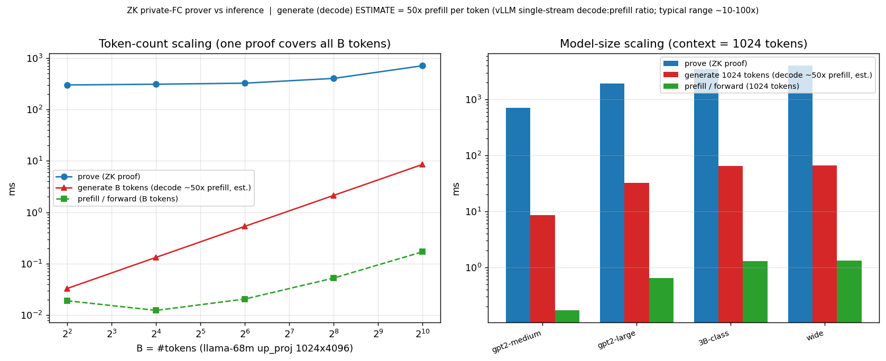
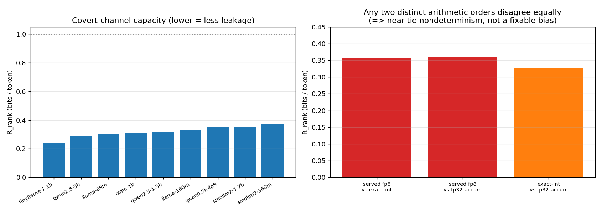
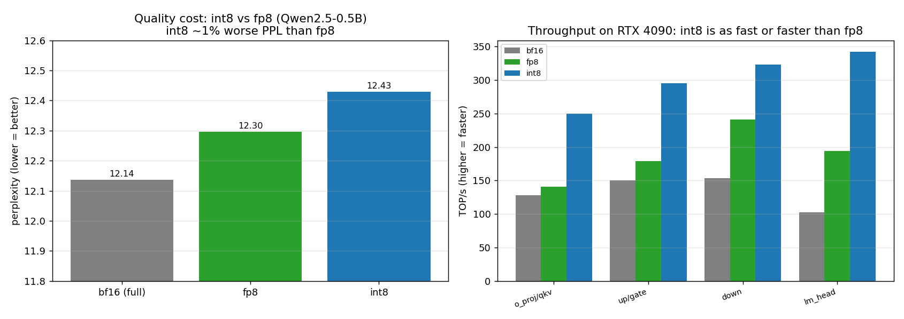

# Verifiable Datacenter Inference: how expensive is the proof, and what can leak?

*A running lab notebook. Written for an ML researcher who does not necessarily know
low-precision number formats, zero-knowledge proofs, or GPU internals — every term is
defined in the primer below. Last updated: 2026-06-22.*

When a datacenter runs a large language model on your behalf, how do you know it actually
ran **the model it claims** — the full one, on your real input — rather than a cheaper,
smaller, or tampered substitute? **Zero-knowledge proofs (ZKPs)** can certify the
computation *without revealing the model's (private) weights*. This page reports
measurements on two questions:

1. **How expensive is such a proof?** (Part 1)
2. **If the proof certifies model A but the datacenter secretly serves a slightly
   different model B, how much hidden information can it smuggle out through the gap?**
   (Part 2) — and **how do we close that gap?** (Part 3)

---

## 0. Five-minute primer (skip if you know dtypes, ZKPs, and GPUs)

**Number formats ("dtypes") and quantization.** A model's weights are just numbers. Stored
at full precision they are 16- or 32-bit floats (`bf16`, `fp32`). To run faster and use less
memory you *quantize* them to 8 bits. Two flavors matter here:
- **fp8** — an 8-bit *floating-point* format. The common one, **E4M3**, spends 1 bit on sign,
  4 on an exponent, 3 on a mantissa, covering roughly ±448. The exponent gives it a **wide
  dynamic range**, so a few very large values don't wreck the precision of the rest.
- **int8** — plain 8-bit *integers* (−127…127) plus a few "scale factors" that map them back
  to real values. Narrower range, so it needs more careful calibration, but it is exact
  integer arithmetic.

Lower precision → much faster matrix multiplies, at the cost of a little accuracy.

**GPUs and matmuls.** An LLM forward pass is mostly large **matrix multiplications**
(matmuls). GPUs have dedicated **tensor cores** that do low-precision matmuls extremely fast;
throughput is quoted in **TOP/s** (trillions of operations per second). Running all the
matmuls once over a batch of tokens is a **forward pass**, also called **prefill** when it
processes a prompt. **Generation (decode)** produces text one token at a time; it is much
slower *per token* because each new token must re-read the entire weight matrix from memory.

**Zero-knowledge proofs (ZKP) and zkML.** A ZKP lets a *prover* convince a *verifier* that
"I computed output Y from public input X using my committed secret weights W" — **without
revealing W**, and without the verifier redoing the work. For matmuls there are two cheap
tricks:
- **Freivalds' check.** To verify `Y = X·W`, pick a random vector `r` and check
  `Y·r = X·(W·r)`. This turns an expensive O(n³) recomputation into a cheap O(n²) check.
- **Sumcheck / GKR.** An interactive protocol that proves a giant sum (or matmul) while the
  verifier does only tiny work; combined with a cryptographic *commitment* to W it keeps the
  weights private.

The catch: **both tricks need exact integer arithmetic.** Floating-point rounding breaks the
algebra they rely on. That is *why* the natural object to prove is an **integer model**.

---

## Part 1 — How expensive is a ZK proof of inference?

We built a GPU prover (hash-based: Goldilocks field + sumcheck + a FRI/Basefold commitment,
no trusted setup) for the core operation — **one fully-connected layer `Y = X·W`** — and
measured proving time, verification time, and proof size as a function of model size and
number of tokens, on a single RTX 4090.

What the numbers say (at a 1024-token context, after a round of prover optimizations):

| layer size (≈ model) | prove time | verify time | proof size |
|---|---|---|---|
| 1024×4096  (≈ small) | ~0.7 s | ~45 ms | ~3.5 MB |
| 2048×8192  (≈ GPT-2-large) | ~1.9 s | ~50 ms | ~3.9 MB |
| 4096×8192  (≈ 3B-class) | ~3.5 s | ~52 ms | ~4 MB |

Three takeaways:

- **One proof covers the whole batch.** Proving cost barely grows with the number of tokens
  (it is dominated by the weight matrix, which is shared), so the *per-token* overhead falls
  as you process more tokens.
- **Verification is cheap and the proof is small** (tens of ms, a few MB) even as the model
  grows — that is the point of a succinct proof.
- **The proof is far more expensive than the inference it certifies.** A forward pass of one
  layer is microseconds; *generating* tokens is ~50× slower per token than prefill (decode is
  memory-bound — see the primer). Against realistic **generation**, the proof overhead is
  roughly **20–80×**; against a batched **prefill** it looks like ~1000×. The honest framing
  is "tens of times slower than generating the text," and **the proof — not the inference —
  is the dominant cost** of verifiable inference. (Caveat: this prover currently certifies the
  *computation* correctly but is not yet fully zero-knowledge about the activations; full ZK
  adds a roughly constant factor on top.)

---

## Part 2 — The covert-channel problem

Here is the subtlety that makes "verifiable inference" harder than it looks. Because ZK proofs
want **integer** arithmetic but datacenters serve in **fp8** for speed, a natural design is:

- **Serve** tokens from the fast **fp8** model (`M_q`), but
- **Prove** them against an **integer** model (`M_int`).

`M_q` and `M_int` hold the *same weights*; they only compute *slightly differently* (fp8
arithmetic vs integer arithmetic). The verifier accepts a served token if it is "close enough"
to what `M_int` would have produced. **That tolerance is slack** — and a malicious datacenter
could use it to encode hidden bits into its token choices: a **covert channel** that exfiltrates
secrets while still passing the proof.

**How we measure the leak — "rank entropy" (`R_rank`).** Couple the two models with shared
randomness (a shared Gumbel draw, the standard way to compare samplers) and ask: at each
generated token, **where does the served token rank in `M_int`'s preference list?** If it is
almost always `M_int`'s #1 choice, there is little slack. We report the **Shannon entropy
(bits per token) of that rank distribution**. (Ties in the ranking are broken by token ID, a
detail that turns out not to change the numbers.)

- **Left:** across models, `R_rank ≈ 0.24–0.37 bits/token` (≈ 0.36 for the fp8 Qwen2.5-0.5B
  we focus on). Equivalently, the served token *is* `M_int`'s top choice ~94% of the time.
  So the honest leakage is small but nonzero — on the order of **one hidden bit every ~3
  tokens**.
- **Right (the key finding):** this gap is **not a fixable bias.** We compared three ways of
  computing the same matmul — the fp8 kernel, an exact-integer reconstruction, and a plain
  fp32 sum — and **any two distinct ones disagree about equally** (~0.33–0.36 bits). The
  disagreement lives entirely at the ~6% of positions where the top-two tokens are nearly
  tied; there, the tiny rounding differences between *any two different orders of summation*
  flip the winner. In other words, the residual is **near-tie floating-point
  nondeterminism**, not something you can remove by picking a cleverer integer scheme.

So: you cannot shrink the covert channel by being smarter about *which integer model you
prove*. The only way to drive it to zero is to make the served arithmetic **identical, bit for
bit,** to the proven arithmetic.

---

## Part 3 — Closing the gap (and: isn't an integer model slow?)

The clean fix is to stop the "serve fp8, prove integer" split and instead **serve the exact
integer model you prove.** Exact integer addition has a *single* answer — there is no
summation-order ambiguity, so the near-tie chaos simply disappears and `R_rank → 0`. As a
bonus, an exact integer matmul is also the **cheapest possible thing to prove** (it is exactly
what Freivalds and sumcheck want).

The obvious objection: *won't serving an integer model be slow?* We measured it.

- **Quality (left).** On Qwen2.5-0.5B, perplexity is 12.14 (full bf16) → 12.30 (fp8) → 12.43
  (int8). So **int8 costs only ~1% perplexity over fp8** — using only basic per-row/per-token
  quantization, no fancy calibration. fp8's small edge comes from its wider dynamic range
  (better at activation outliers), consistent with the literature; standard int8 calibration
  (SmoothQuant-style per-group scales) closes most of the remaining gap.
- **Speed (right).** On an RTX 4090, **int8 matmuls are as fast or faster than fp8** — e.g.
  342 vs 194 TOP/s on the LM-head matmul, and 1.3–1.8× faster across the layer shapes. (On
  H100-class hardware fp8 and int8 are closer, both native.) Serving int8 is **not** a
  slowdown.
- **And the economics.** Recall from Part 1 that the **proof dominates cost** (~hundreds× the
  inference). Keeping fp8 serving to save a little inference would force the proof to *replay
  fp8's exact accumulation*, which independent analysis puts at **50–1000× more proving cost**.
  Trading ~1% quality (recoverable) for the cheapest proof and a **zero covert channel** is the
  right call.

**Bottom line.** Serve the deterministic integer model you prove (int8 with calibration; or an
exact integer reconstruction of the fp8 checkpoint if you want to keep the fp8 *values*), add
committed-seed sampling, and the covert channel from arithmetic mismatch closes — at the same
inference speed and the cheapest proof.

---

## Summary

| Question | Answer (this work) |
|---|---|
| Cost of a ZK proof of one layer | ~0.7–3.5 s prove, ~50 ms verify, ~4 MB, on a 4090; ~20–80× realistic generation |
| Covert-channel capacity (serve fp8, prove int) | ~0.24–0.37 bits/token; served token is top-1 ~94% of the time |
| Where the leak comes from | near-tie floating-point nondeterminism — not a fixable bias |
| Can a cleverer integer model fix it? | No (any distinct arithmetic order leaks ~equally) |
| Does serving the integer model fix it? | Yes → `R_rank` 0, and it is the cheapest proof |
| Is the integer model slow? | No — int8 ≈ or faster than fp8; ~1% perplexity cost |

### Open problems / what's next
- **Full zero-knowledge** for the prover (currently certifies the computation correctly but
  does not yet hide the activations); this is the main remaining cryptographic step.
- **Deterministic / batch-invariant serving kernels** (so "served == proven" holds across
  batch sizes), and **committed-seed sampling** to close the residual sampling-choice channel.
- **Scaling** the prover to larger models and full multi-layer generation.

### Methods & reproducibility
Hardware: single NVIDIA RTX 4090 (Ada, 24 GB). Models: Qwen2.5-0.5B (and its fp8 checkpoint),
plus a family of small open models for the rank-entropy sweep. Prover: a hash-based
sumcheck+FRI/Basefold system over the Goldilocks field. All quantities above are measured on
this machine; perplexity is on held-out natural text, throughput is the matmul kernels in
isolation, and the rank-entropy coupling uses a shared Gumbel seed with ties broken by token
ID. (Code and raw JSON live alongside this page in the repository.)

### Sources (background reading)
- [FP8 Formats for Deep Learning (Micikevicius et al.)](https://arxiv.org/pdf/2209.05433)
- [Efficient Post-Training Quantization with FP8 Formats (MLSys 2024)](https://proceedings.mlsys.org/paper_files/paper/2024/file/dea9b4b6f55ae611c54065d6fc750755-Paper-Conference.pdf)
- [An Investigation of FP8 Across Accelerators for LLM Inference](https://arxiv.org/html/2502.01070v1)
- [LLM Inference Unveiled: Survey and Roofline Model Insights](https://arxiv.org/pdf/2402.16363)
- [zkLLM: Zero-Knowledge Proofs for Large Language Models (CCS 2024)](https://arxiv.org/abs/2404.16109)
